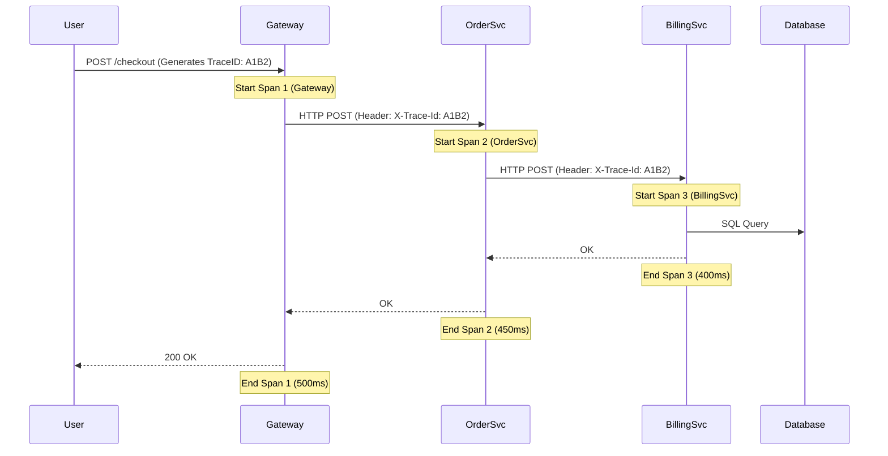

# Part 25: Observability, Metrics & Telemetry

You cannot fix a system that you cannot see. In a distributed microservices environment spanning hundreds of servers, traditional debugging is impossible. When a user clicks "Checkout" and the request hangs for 10 seconds, how do you know which of the 15 microservices caused the latency?

You solve this with the **Three Pillars of Observability**: Metrics, Logs, and Distributed Traces.

---

## 📊 1. Metrics (The "What" is happening)

Metrics are numerical measurements of your system over time. They are cheap to store and incredibly fast to query.

*   **Key Metrics (The RED Method):**
    *   **R**ate: The number of requests per second (e.g., 500 QPS).
    *   **E**rrors: The number of failed requests (HTTP 500s).
    *   **D**uration: The latency of requests (e.g., 99th percentile takes 200ms).

### Architecture: Push vs Pull
How do you collect metrics from 10,000 servers?

1.  **Push Model (StatsD, Datadog):**
    *   Every microservice actively *pushes* a UDP packet containing its current CPU usage or request count to a centralized metrics server every 10 seconds.
    *   *Flaw:* If you spin up 50,000 containers during a traffic spike, 50,000 servers simultaneously hammering the central metrics server can accidentally DDOS your own monitoring infrastructure.
2.  **Pull Model (Prometheus - Industry Standard):**
    *   The microservices do *not* push data. They just expose a local HTTP endpoint (e.g., `http://server-ip/metrics`) storing their current stats in plain text.
    *   A centralized Prometheus server has a master list of all live container IPs. Prometheus explicitly *crawls* (pulls) the `/metrics` endpoint of every container sequentially at a controlled, safe interval. This guarantees the monitoring system cannot be DDOSed by scaling events.

---

## 📜 2. Logs (The "Why" it is happening)

Logs are immutable, timestamped text records of discrete events (e.g., `[ERROR] 2023-10-25 User 54 failed password check`).

### The Aggregation Problem
In a monolithic app, you just SSH into the server and type `tail -f /var/log/app.log`.
In a 500-container Kubernetes cluster, containers die and vanish every minute, taking their local hard drives and logs with them.

### The ELK Stack Solution
**E**lasticsearch, **L**ogstash, **K**ibana.

1.  **Logstash/FluentBit (The Shipper):** A tiny background agent installed on every single physical server. It watches the local text logs generated by Docker containers and instantly streams every new line over the network.
2.  **Elasticsearch (The Database):** A massive, distributed NoSQL search engine (built on Apache Lucene). It ingests the billions of log lines from FluentBit and indexes every single word, instantly.
3.  **Kibana (The Dashboard):** The UI. You can type `error AND user_id: 54` and Kibana instantly queries Elasticsearch, returning the exact log line spanning the entire 500-server cluster in milliseconds.

---

## 🕸️ 3. Distributed Tracing (The "Where" it is happening)

When a REST API call spans Payment, Inventory, and Notification services, how do you trace the holistic lifecycle of that single HTTP request?

### OpenTelemetry & Jaeger
We must inject a unique ID into the HTTP headers that mathematically links all the disjointed logs together.

**How it Works:**
1.  **Trace ID:** When the request hits the API Gateway, the gateway generates a cryptographically random UUID (e.g., `TraceID: A1B2`).
2.  **Propagation:** The gateway injects `X-Trace-Id: A1B2` into the HTTP headers sent to the internal microservices. Every downstream microservice must faithfully extract this header and pass it along to the next service.
3.  **Spans:** Each service records exactly when it received the request and when it finished processing it (a "Span").
4.  **Reporting:** Each service asynchronously sends its Span data (containing the shared Trace ID) to a central Jaeger or Zipkin server.
5.  **The Result:** The Jaeger UI pieces all the Spans back together into a visual Gantt chart. You can vividly see: *"The Gateway took 500ms entirely because the internal BillingSvc took 400ms to execute a slow SQL query."* This reveals exactly *where* the latency lives.

---

## Frequently Asked Tricky Interview Questions
**Q: "If you have 1,000 microservices processing 50,000 requests per second, logging everything will cost millions of dollars in Datadog/Splunk bills and crash your disk I/O. What is the standard industry workaround?"**
*Answer:* **Dynamic Sampling / Tail-Based Sampling**. You do not log every request. You log $1\%$ of `HTTP 200 OK` transactions. However, if a request results in an `HTTP 500 Error`, or if the latency takes $> 2	ext{ seconds}$, the system overrides the sample rate and guarantees that $100\%$ of those pathological traces are permanently logged. This captures $100\%$ of the critical bugs while slashing the logging bandwidth bill by $99\%$.

**Q: "How do you trace an error back to its source if a single API call cascades through 15 different microservices (A -> B -> C... -> O) before failing at Service O?"**
*Answer:* **Distributed Tracing (OpenTelemetry / Jaeger / Zipkin).** The very first service (API Gateway) injects a unique cryptographically random string (the `X-Correlation-ID` or `Trace-ID`) into the HTTP Header. Every single downstream microservice strictly forwards this exact header into its outbound requests and attaches the ID to its log statements. When an error fires at Service O, you search Datadog for that single `Correlation-ID`, giving you the exact unified chronological stack trace of all 15 services interacting.
