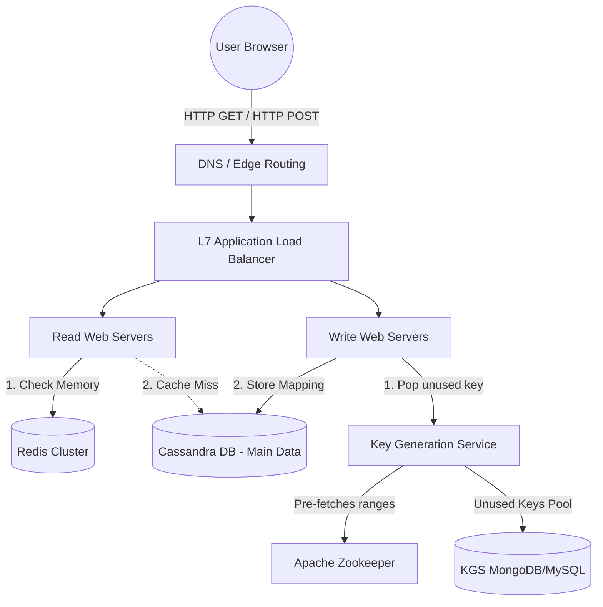
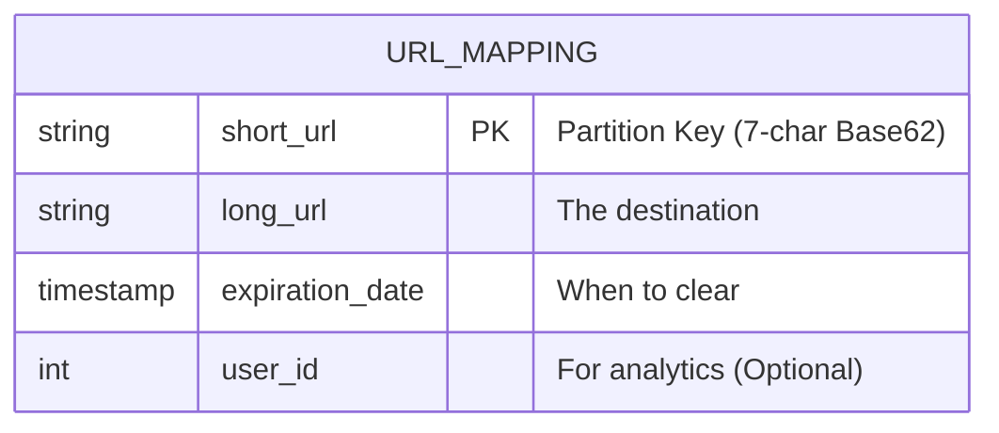

# 🔗 Design a Short URL Service (Bitly)

**Core Domains:** URL Shortening, Read-Heavy Caching, Pre-computation.  
**Primary Concepts Demonstrated:** Key Generation Service, Base62 Encoding, Collision Handling, Read/Write Amplification Limits.

---

## 1. Scope & Requirements (Back-of-the-Envelope)
A short URL service seems deceptively simple but tests your ability to handle massive read-to-write ratios and hash collision mathematics.

*   **Traffic Focus:** Extremely Read-Heavy (typically a 100:1 read-to-write ratio).
*   **Write Throughput:** 100 Million new URLs generated per month (approx. 40 writes/sec).
*   **Read Throughput:** 10 Billion reads per month (approx. 4,000 reads/sec).
*   **Storage (5 Years):** $100M \text{ writes/month} \times 12 \text{ months} \times 5 \text{ years} = 6 \text{ Billion records}$.
    *   If one record (Short URL + Long URL + metadata) is $\approx 500$ bytes, $6B \times 500B \approx 3 \text{ TeraBytes}$. This easily fits in a NoSQL distributed database.
*   **Latency:** Read latency must be strictly $<10ms$.

---

## 2. API Design & Capacity Limits
*   `createShortUrl(api_dev_key, original_url, custom_alias=None)` -> returns string `short_url`
*   `getOriginalUrl(api_dev_key, short_url)` -> returns string `original_url` (translates to an HTTP 301 Redirect).

### HTTP 301 vs 302 Redirect Limitation
*   **HTTP 301 (Permanent):** The browser caches the redirect. Subsequent requests jump straight to the long URL. **Pro:** Reduces load on our servers heavily. **Con:** We lose analytics tracking since requests bypass us.
*   **HTTP 302 (Found/Temporary):** The browser queries our server *every single time*. **Pro:** Perfect analytics. **Con:** High load, requires extreme distributed caching (Redis).

---

## 3. High-Level Design (HLD)

The naïve approach is to take the long URL, hash it via MD5, and take the first 7 characters. However, if two users input the same long URL, or if MD5 collides, we have a **Hash Collision Constraint**. 

Instead of generating keys dynamically, we use an **offline Key Generation Service (KGS)**. This service pre-computes unique 7-character Base62 strings and stores them in a standalone DB.

---

## 4. Low-Level Design (LLD) & Data Schema

### Why Base62?
Base62 uses `[A-Z, a-z, 0-9]` giving 62 possible characters. A 7-character string yields $62^7 = 3.5 \text{ Trillion}$ combinations. This is vastly larger than our 6 Billion record requirement for 5 years.

### Schema Choice: NoSQL (Cassandra / DynamoDB)
Since we are storing billions of flat, unrelated records (no `JOIN` operations required) and need massive horizontal read scalability, a Wide-Column or Key-Value store is ideal.

---

## 5. System Bottlenecks & Edge Cases

### A. The "Thundering Herd" & Cache Stampede
If a short URL becomes viral (e.g., posted on the Super Bowl broadcast), millions of users hit the server. If the Redis cache expires, all 1M users simultaneously rush the Cassandra DB to resolve the key, a **Cache Stampede**, crashing the DB.
*   **Mitigation:** Provide a **Probabilistic Cache Expiration** or **Distributed Lock (Redlock)**. Only the first incoming request is allowed to query the DB; the other 999,999 requests wait for the first process to repopulate the Redis cache.

### B. Zookeeper Concurrency Issues in KGS
How do multiple concurrent API servers pull from the KGS without grabbing the same Base62 key?
*   **Mitigation:** The KGS doesn't hand out keys one by one. It assigns **Blocks** to API servers via Apache Zookeeper. 
    *   Server 1 gets keys `1-100,000`.
    *   Server 2 gets keys `100,001-200,000`.
    *   They load these into their local RAM. Even if they crash and lose 100k keys, we have 3.5 Trillion to spare. Fast, lock-free, local memory generation.

### C. Malicious User Rate Limiting
A user might write a script to generate millions of URLs to exhaust our KGS pool.
*   **Mitigation:** Implement a Token Bucket Rate Limiter at the API Gateway level using Redis `EXPIRE` counters keyed to the user's `api_dev_key`.
