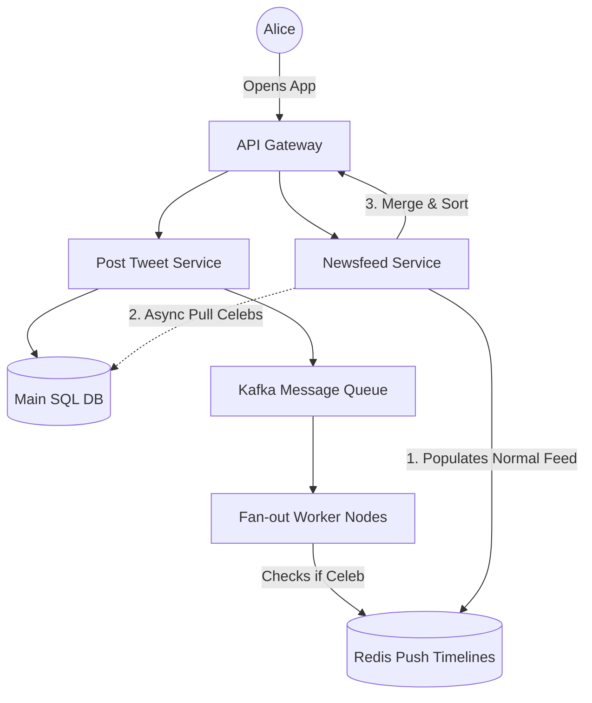
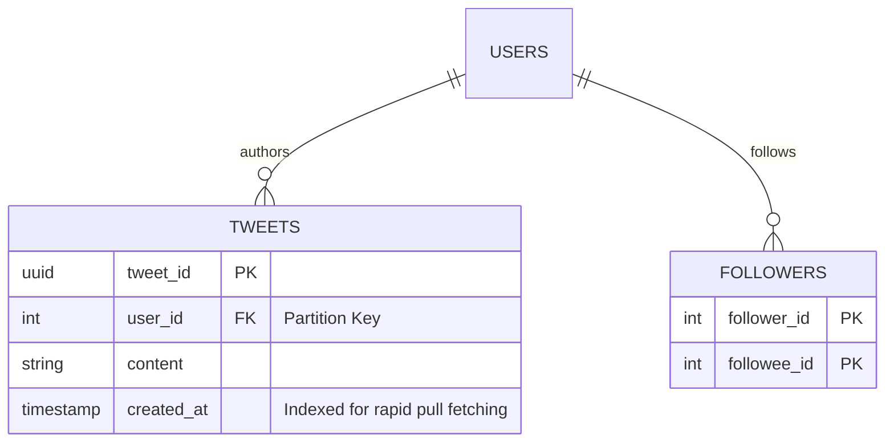

# 🐦 Design a Social Media Newsfeed (Twitter / X / Facebook)

**Core Domains:** Feed Generation, Fan-out, Push vs Pull Strategies.  
**Primary Concepts Demonstrated:** The Celebrity Problem, Eventual Consistency, Redis Caching, Timeline Sorting.

---

## 1. Scope & Requirements
Building a timeline is one of the most classic system design problems. The goal is to aggregate posts from all the people a user follows into a single, chronologically (or algorithmically) sorted feed.

*   **Traffic Focus:** Extremely Read-Heavy. Users scroll infinitely more than they post.
*   **Write Throughput:** 50,000 tweets per second globally.
*   **Read Throughput:** 300,000 timeline reads per second globally.
*   **Latency constraint:** Timeline generation must occur in $<200ms$.

---

## 2. The Core Bottleneck: Fan-Out Strategies
A naive SQL `JOIN` between a `User` table, `Follower` table, and `Tweet` table will immediately crash the database due to scanning millions of rows per user. 

To solve this, feed data is pre-computed and stored in rapid caches (Redis) via **Fan-Out processing**.

### Approach A: Fan-out on Write (Push)
When Bob posts a tweet, the system instantly grabs all 100 followers of Bob and *pushes* the tweet into their personal Redis timelines.
*   **Pros:** Instant timeline reads. It's $O(1)$ to fetch the timeline.
*   **Cons:** **The Celebrity Problem (Justin Bieber effect).** If a user with 100 Million followers posts, the system performs 100 Million writes to Redis timelines simultaneously, stalling the entire message queue and causing massive "Write Amplification".

### Approach B: Fan-out on Read (Pull)
We do not push tweets. When Alice loads her timeline, the system grabs all the people she follows, fetches their recent tweets on the fly, merges, and sorts them.
*   **Pros:** Solves the Celebrity Problem. No unnecessary writes for inactive followers.
*   **Cons:** Reads become incredibly slow and CPU-intensive as they scale $O(N \log N)$ based on follow count.

---

## 3. High-Level Design (HLD): The Hybrid Approach
The industry standard is a hybrid model.
1.  **Normal users** (e.g., $<10,000$ followers) use **Fan-out on Write**.
2.  **Celebrities** (e.g., $>10,000$ followers) use **Fan-out on Read**.

When Alice opens her app, the API pulls her pre-computed timeline from Redis (normal friends) and *merges* it dynamically with the latest posts from Celebs she follows via a fast DB index.

---

## 4. Low-Level Design (LLD) Database Architecture
Relational Databases handle structured metadata well, but object blobs (photos/videos) should be in an S3-compatible store.

### Main SQL DB (PostgreSQL)
We shard the database based on `user_id` to distribute load.

### Redis Timeline Structure
The Redis timeline is usually stored as a `Sorted Set (ZSET)`, where the score is the UNIX timestamp and the value is the `tweet_id`.
By only storing the `tweet_id` (typically 8 bytes), we save massive RAM. The actual string content is fetched in a bulk batch from a separate cache if missing.

---

## 5. System Intricacies & Edge Cases

### A. Infinite Scrolling Pagination
You cannot use standard SQL `OFFSET` and `LIMIT` for pagination. `OFFSET 1000` requires SQL to scan and discard 1,000 rows, destroying latency.
*   **Mitigation:** Use **Cursor-based Pagination**. Pass `max_tweet_id=987654` to the backend, and the DB uses an indexed lookup `WHERE tweet_id < 987654 LIMIT 20`.

### B. Eventually Consistent Follower Counts
When a celebrity gets 10,000 follows a second, putting a `COUNT(*)` query or row lock on their profile counter will choke the database.
*   **Mitigation:** Use an asynchronous counter. Let users click follow, drop the event into a Kafka stream, and let an aggregator slowly increment the Redis counter every 5 seconds. The user sees "Joined" instantly, but global counts are **Eventually Consistent**.

### C. CDN Integration for Media
If every image load goes through our API servers, our bandwidth costs will bankrupt us.
*   **Mitigation:** Store the raw media on Amazon S3 and cache it geographically using a CDN (Cloudflare/Akamai). The API only returns the presigned CDN URL in the JSON payload.

---

## 6. Frequently Asked Hard Interview Questions
**Q: What happens if a celebrity deletes a tweet from 5 years ago? Do you have to scan and remove it from 100 Million Redis timelines?**
*Answer:* Scanning 100 Million Redis lists is physically impossible. This is why the timeline Redis `ZSET` only stores the `tweet_id`. When a user loads their feed, the API takes those 20 `tweet_id`s and does a bulk fetch from the primary DB (or a separate tweet content cache). When the Tweet is deleted, it is removed from the *primary DB*. The `tweet_id` remains in the users' Redis feed safely, but when the API attempts the bulk fetch, it returns `null` for that specific ID, and the API simply filters it out before sending the JSON to the mobile app.

**Q: How do you handle "Muted Words" or "Blocked Users" efficiently without slowing down feed generation?**
*Answer:* Filtering cannot happen when writing to the Fan-out queue, because a user can update their muted words at any time. It must happen closely at read time. The API Gateway queries a highly optimized Bloom Filter or local cache of the user's "Blocked IDs" and "Muted Hashes" during the final Timeline Merge step, silently dropping offending `tweet_id`s before transmission.
