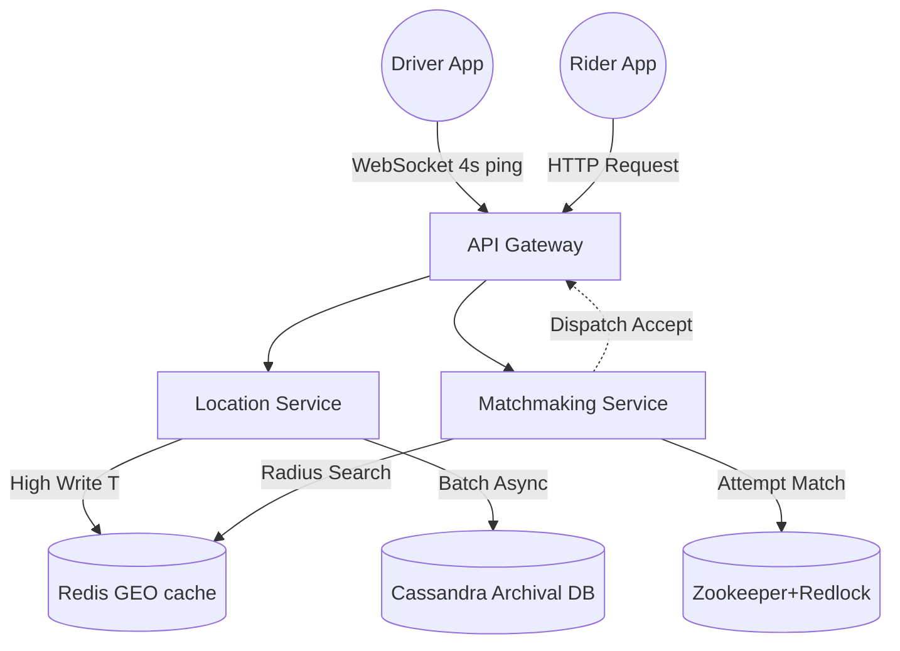
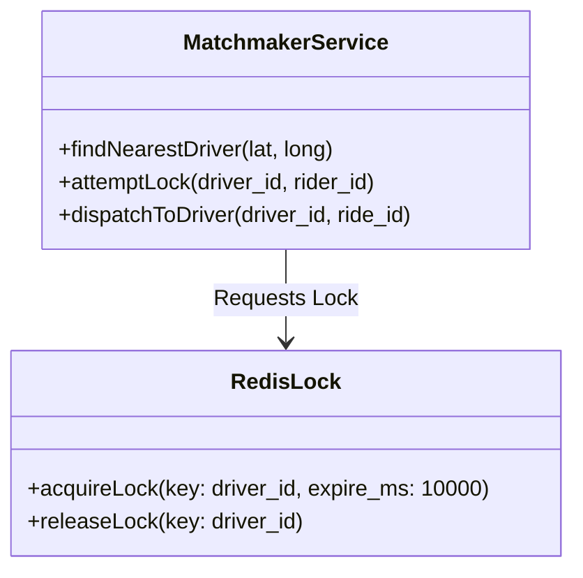

# 🚗 Design a Ride-Hailing Service (Uber / Lyft)

**Core Domains:** Geospatial Search, Write-Heavy Broadcasting, Concurrency.  
**Primary Concepts Demonstrated:** QuadTrees vs Geohashing, Distributed Locking, WebSockets, Redis GEO.

---

## 1. Scope & Requirements
Uber and Lyft rely on complex geospatial matchmaking. We are tasked with building the backend that takes a rider's request and pairs them instantly with the closest available driver.

*   **Traffic Focus:** Extremely Write-Heavy. Every driver broadcasts their GPS coordinates every 4 seconds.
*   **Write Throughput:** 1 Million active drivers sending logic every 4s = 250,000 writes/sec to the location service.
*   **Read Throughput:** 5,000 riders requesting rides/sec (location lookups are intensive).
*   **Latency constraint:** Driver location tracking must feel real-time ($<200ms$), matchmaking takes $<5s$.

---

## 2. API Design & Broadcasting Architecture
Because drivers need to continuously ping a server, maintaining HTTP $1.1$ connections over raw mobile networks is terribly inefficient.

*   **Connection Protocol:** We establish full-duplex persistent **WebSockets** or **Server-Sent Events (SSE)** between the Driver App and our API Gateways. The driver blindly pumps coordinates over long-lived TCP connections.

### APIs
*   `updateDriverLocation(driver_id, lat, long)` (Every 4 seconds via WebSocket)
*   `requestRide(rider_id, pickup_lat, pickup_long, dest_lat, dest_long)` (REST POST)
*   `match_status(ride_id)` (GET - SSE feed on matchmaking status)

---

## 3. High-Level Design (HLD) & Matchmaking
The system is cleanly split between Location Tracking (ingesting writes) and Matchmaking (complex reads).

---

## 4. Addressing Geospatial Search Limitations
If you run a standard SQL query: `SELECT * FROM drivers WHERE lat BETWEEN x AND y AND long BETWEEN a AND b`, you will force the database to do a full-table scan on 1 Million active rows every second. This completely crashes standard databases.

We must convert 2D coordinates into 1D strings to utilize indexed or $O(1)$ lookups.

### Approach A: Geohashing
Geohashing mathematically chops the world map into a grid and assigns a string (e.g., `9q8yy`). If you zoom in closer, the string gets longer (`9q8yyz`). Finding nearby drivers becomes an incredibly fast String Prefix Match query `WHERE location LIKE '9q8yy%'`.

### Approach B: QuadTrees (Uber's H3 approach)
A custom tree structure where the root node is the world map, split into 4 children (NW, NE, SW, SE). When a grid node holds more than 500 drivers, the node structurally partitions itself into 4 deeper children.
*   *Limitation:* You cannot build QuadTrees fast enough if they are constantly moving. Drivers update every 4 seconds. To reconstruct a giant tree every 4 seconds is mathematically impossible.
*   *Solution:* We don't reconstruct the tree dynamically. We pre-build the tree grid, and only shift `driver_id`s in and out of the static grid cells in **Redis RAM** instead of updating disk-based nodes.

---

## 5. Low-Level Design (LLD) Concurrency Locks

### The Double-Booking Bottleneck
What happens when two riders (Rider A and Rider B) request a ride at the precise exact millisecond in identical locations, and the system attempts to match both of them to the same Driver C nearby?

Without distributed consensus, Driver C will receive two pings at once or the system will crash by dispatching the driver to two distinct places.

### Solution: Pessimistic Distributed Locking
When the matchmaking service selects Driver C as the best fit for Rider A, it *locks* Driver C by placing a TTL (Time-To-Live) heavily guarded flag in a robust coordination service like **Apache Zookeeper** or **Redis Redlock**.

*   The system locks Driver C for 10 seconds.
*   It dispatches to Driver C.
*   If Driver C declines (or time expires), it releases the lock and moves to the next closest driver.
*   During this 10s window, if Rider B's process queries Driver C, the process sees the Zookeeper lock and safely skips them.

---

## 6. Real-World Limitations
1. **Network Disconnects:** Drivers go through tunnels. Their WebSockets suddenly drop.
    *   *Mitigation:* Soft vs Hard states. If a ping drops, they fade to yellow "Soft Offline" keeping their lock active for 60s before being cleanly evicted.
2. **Archival DB Write Thrashing:** We must save route data for billing/legal reasons. But writing 250k rows/sec to disk will destroy Cassandra SSDs.
    *   *Mitigation:* **Write Buffering in memory.** The location service caches GPS points locally, and only performs a batch insert dump to Cassandra once every 30 seconds per driver.

---

## 7. Frequently Asked Hard Interview Questions
**Q: A driver is driving 80 MPH on a highway. Their WebSocket connection drops while crossing a tunnel. Who owns the distributed lock for their state, and how is it resolved?**
*Answer:* The Backend introduces a "Soft Offline" state. When the ping timeout exceeds 5 seconds, the driver is marked `Ghosted` or `Soft Offline` in Redis (using a strict TTL to auto-evict). The matchmaking engine will heavily penalize them in the sorting algorithm but won't delete them instantly. If they reconnect within 30 seconds via a fresh WebSocket, the new socket takes over the session seamlessly.

**Q: Exact Distance vs. Great-Circle Distance? If the QuadTree says a driver is physically 2 miles away, but there's a river between them with no bridge, it might take 20 minutes to drive. How do you fix this?**
*Answer:* The QuadTree simply performs a fast mathematical radius reduction (yielding perhaps 50 nearby drivers). Then, a dedicated **Routing/ETA Service** (relying on Graph traversal algorithms or pre-computed road networks like OSRM/Google Maps API) analyzes those 50 drivers to calculate precise road-network drive times. The user is matched based on minimal *Time*, not minimal geographical distance.
