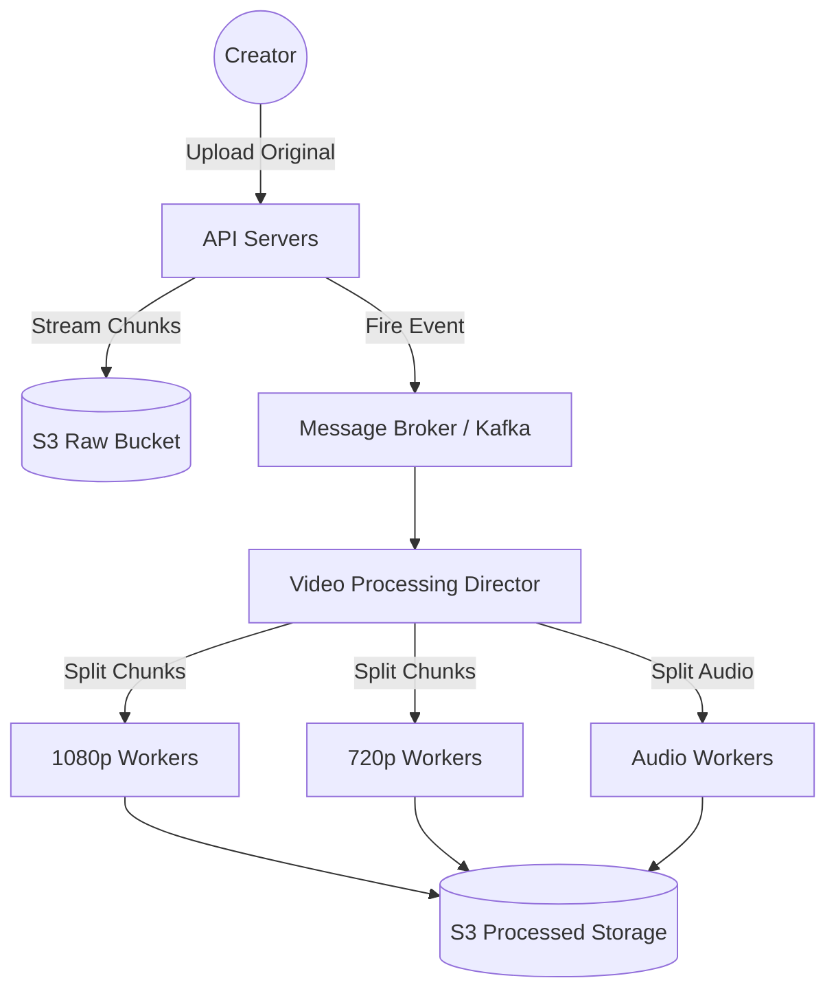
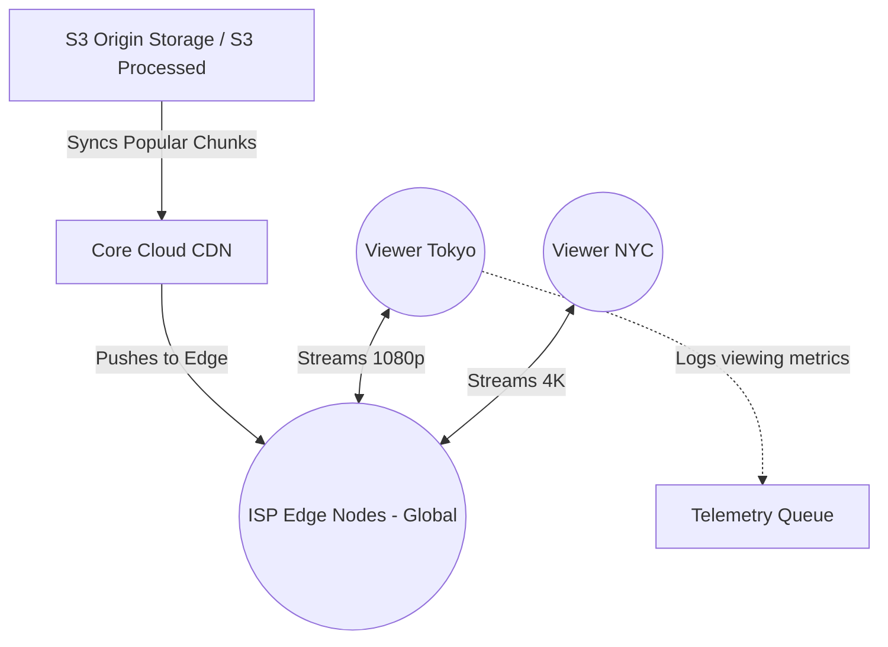

# 🍿 Design a Video Streaming Service (YouTube / Netflix)

**Core Domains:** Blob Storage, CDN Orchestration, Media Processing Pipelines.  
**Primary Concepts Demonstrated:** Video Transcoding DAGs, Adaptive Bitrate Streaming, Block-Level Storage, Read-Through Caching.

---

## 1. Scope & Requirements
Video streaming is singularly focused on extreme bandwidth and large-object processing. The system must ingest massive gigabyte-sized files, compress them, and deliver them globally without buffering.

*   **Traffic Focus:** Immense continuous read bandwidth. Heavy burst writes (uploads).
*   **Write Throughput:** 500 hours of video uploaded per minute globally.
*   **Read Throughput:** 5 Billion video streams viewed per day.
*   **Latency constraint:** Video playback must start within $<2s$. Playback buffer must never empty (no buffering wheel).

---

## 2. Media Processing Pipeline (Upload Bottleneck)
When a user uploads a 4K, 10GB video, the API servers cannot just hold it in memory, nor can they block the HTTP thread waiting for it to process. It would crash the server immediately.

The raw upload is instantly sunk into **Raw Storage** (like Amazon S3), and a message is fired to a queue to begin **Asynchronous Transcoding**.

### Video Transcoding DAG (Directed Acyclic Graph)
Transcoding (converting a raw video into 1080p, 720p, 480p, mobile, and web formats) is incredibly CPU-intensive. Instead of one server rendering the whole video over 5 hours, the system splits the task into a DAG.

1.  **Chunking:** The 10GB file is split into hundreds of 5-second chunks.
2.  **Parallel Workers:** Hundreds of worker nodes grab chunks from the queue and transcode them simultaneously into 4 different resolutions.
3.  **Watermarking & Audio extraction:** Done in parallel on separate worker groups.
4.  **Merge:** The chunks are stitched back together.

---

## 3. High-Level Design (HLD) & CDN Delivery
Delivering a 4K video directly from a centralized database in Virginia to a user in Tokyo will result in crippling latency and unbearable ISP bandwidth costs.

The solution is a **Content Delivery Network (CDN)** hierarchy. We push popular video chunks to edge-node caches physically located inside ISPs across the globe.

### Adaptive Bitrate Streaming (DASH / HLS)
Netflix and YouTube do not send you one giant file. They dynamically send you 5-second HTTP segments. 
*   If your WiFi drops to 3G speeds, the video player seamlessly swaps to requesting the `480p` segment for exactly the next 5 seconds.
*   *Concept:* The client dictates the quality, not the server.

---

## 4. Low-Level Design (LLD): The "Open Connect" Pattern
Netflix handles so much bandwidth ($~15\%$ of the entire world's internet traffic) that they bypass AWS/GCP CDNs entirely.

They build custom hardware boxes packed with massive SSDs (called **Netflix Open Connect Appliances - OCAs**). They physically mail these boxes to internet providers (Verizon, Comcast) to install locally in city hubs. 

*When you hit play on Stranger Things, the video streams from a hard drive physically sitting just blocks away from your house, bypassing the wider internet completely.*

---

## 5. System Intricacies & Edge Cases

### A. The "Viral Video" Cache Stampede
If a new music video drops, the edge node in Chicago might instantly get 100,000 requests for chunk 1, but the node hasn't synced it from Origin S3 yet. The edge node sends 100,000 fetch requests to Origin S3, DDOSing the origin servers.
*   **Mitigation:** Request Collapsing (Read-Through Caching). The edge node holds 99,999 requests in wait, sends *exactly one* request to the Origin S3, pulls the video chunk, and then fulfills all 100,000 users simultaneously.

### B. Pre-Warming the Cache (Proactive vs Reactive)
If Netflix waits for people to click "Play" to load the cache, the first users experience buffering.
*   **Mitigation:** Predictive pre-warming. The centralized metadata service runs ML algorithms every night to guess what Tokyo will watch tomorrow (e.g., Anime releases). During low-traffic hours (3 AM), the system slowly pushes the files to the Tokyo OCAs. When users wake up, the cache is already 100% warm.

### C. Big Data Analytics Storage
We must track where users pause, rewind, or abandon a video to train the recommendation engine.
*   **Mitigation:** The client fires small `/metrics` JSON payloads every 10 seconds. These are sunk into a massive Kafka cluster, aggregated by Apache Flink, and dumped into a Data Lake (HDFS/S3) for offline Hadoop/Spark ML processing.
EOF
