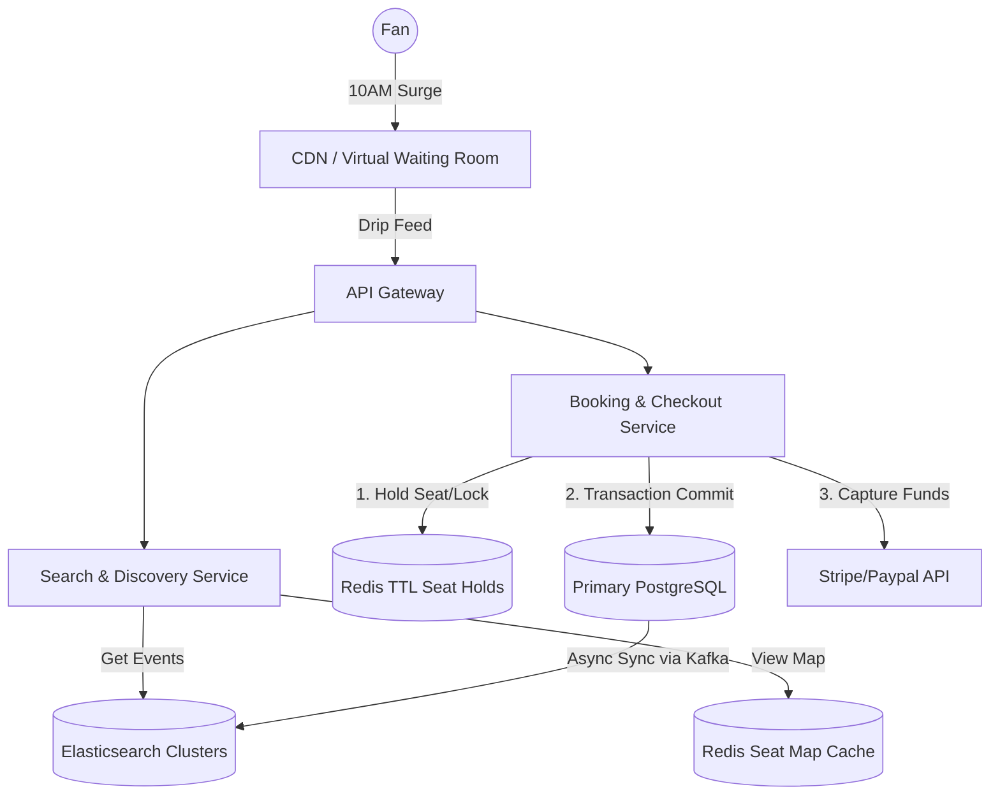
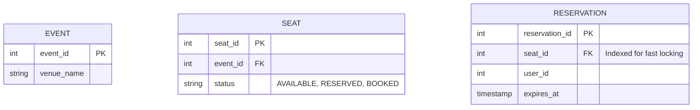

# 🎟️ Design a Highly Concurrent Booking System (Ticketmaster)

**Core Domains:** ACID Transactions, Pessimistic Locking, Surge Traffic Handling.  
**Primary Concepts Demonstrated:** Relational DB Guarantees (RDBMS), Cache TTL, The "Double Booking" Problem, Queueing/Virtual Waiting Rooms.

---

## 1. Scope & Requirements
Unlike social media where generating a feed a second late isn't catastrophic, booking systems deal with high-stakes financial transactions. If two people buy the exact same seat, the company faces severe legal and reputational damage.

*   **Traffic Focus:** Extremely spiky (almost $0$ QPS until 10:00 AM when a Taylor Swift concert drops, instantly surging to 500,000 QPS).
*   **Write Throughput:** 50,000 reservation attempts per second at peak.
*   **Read Throughput:** 400,000 seat map views per second.
*   **Latency constraint:** Seat locks must happen in $<50ms$. Checkout within $<5s$.

---

## 2. Shielding the Infrastructure: The Virtual Waiting Room
If 10 Million people click "Buy Tickets" at exactly 10:00:00 AM, routing all that traffic to the Application Servers or Database is impossible, regardless of how many servers you provision.

### Queueing Strategy
You must deploy a **Virtual Waiting Room** directly at the Edge/CDN or API Gateway level *before* traffic hits your core servers.
*   Users are placed into a deeply scalable Queue (like Amazon SQS or Cloudflare Workers) and given a JWT token with their place in line.
*   The system gradually releases them (e.g., 5,000 users per second) into the actual booking flow to keep the Core SQL Database healthy and within its processing limits.

---

## 3. High-Level Design (HLD)

The system relies on incredibly fast read layers (Search/Seat Map) and strict, rigid write layers (Relational Database) for the actual checkout.

---

## 4. The Core Bottleneck: The Double Booking Problem
This is the single most important part of the interview. 
When user Alice and user Bob click on `Row 1, Seat A` at the precise same millisecond. 

### Approach A: Optimistic Locking (Not Recommended Here)
The database row has a `version` number. Alice and Bob both read version `1`. Alice checks out, updating it to version `2`. Bob tries to checkout with his stale version `1`, fails, and the system tells him "Seat no longer available".
*   *Limitation:* Since traffic is a brutal 50,000 QPS surge competing for just 1,000 seats, you will have extreme contention. Millions of db requests will fail simultaneously, causing massive CPU waste and UX horror.

### Approach B: Pessimistic Locking via SQL
When Alice clicks the seat, the backend executes:
`SELECT * FROM seats WHERE seat_id = 99 AND status = 'AVAILABLE' FOR UPDATE;`
This literally locks the database row physically.
*   *Advantage:* Bob's query halts and waits. It's perfectly safe.
*   *Limitation:* SQL table/row locks are incredibly slow. Row locking 50,000 times a second will choke PostgreSQL.

### Approach C: The Industry Standard (Redis Cache Locks + SQL)
We absorb the initial spike with an in-memory cache, and only use SQL for the final strict settlement.
1.  **The Fast Hold:** When Alice clicks the seat, the backend attempts to set a Redis key `SETNX seat_99_lock "alice_id" EX 300` (Set if Not eXists, Expiry 5 mins).
2.  If Bob requests it 1ms later, Redis instantly rejects him ($<1ms$ latency). Redis handles 100k QPS easily.
3.  Alice now has 5 minutes to enter her credit card. The seat appears greyed out to the world.
4.  **The Strict Commit:** When Alice hits "Pay", the system executes a final ACID Transaction in the Relational DB (Postgres/MySQL) changing `status = BOOKED`. 
5.  If she doesn't pay in 5 minutes, Redis automatically deletes the lock `seat_99_lock`, and the seat turns blue again on the frontend map.

---

## 5. Low-Level Design (LLD) ACID Schema

---

## 6. System Intricacies & Analytics
### A. The Payment Gateway Black Hole
When communicating with Stripe, the HTTP request might time out. Did Stripe charge the user or not?
*   **Mitigation:** **Idempotency Keys**. The Booking Service generates a unique UUID (e.g., `req_abc123`). When calling Stripe's API, it passes this key. If the request crashes and retries, Stripe sees the same Idempotency Key and safely returning the cached success response rather than double-charging Alice's card.

### B. Scalable Data Delivery (WebSockets for Seat Maps)
Users want to see seats changing from blue to grey instantly without refreshing the page.
*   **Mitigation:** Implement **Server-Sent Events (SSE)**. The client subscribes to a `/stream/event/123` endpoint. When any Redis lock occurs or drops, Kafka pushes an event to a Notification Service, which blasts the state change down to all 50,000 connected browsers via SSE concurrently.

---

## 7. Frequently Asked Hard Interview Questions
**Q: Scalpers write automated bots that bypass the UI to hammer the API directly. How do you defend the lock system?**
*Answer:* The Virtual Waiting Room enforces cryptographic CAPTCHAs (Proof of Work or Cloudflare Turnstile). Furthermore, we use behavioral ML at the Edge. If a specific JWT token requests 5 distinct seats across the stadium in under 500ms, it is mathematically inhuman. The API Gateway instantly revokes their JWT and IP-bans them. Lastly, ticket transfers are disabled, pinning the ticket permanently to the purchaser's ID/Phone number.

**Q: What happens if the Redis node holding the locks crashes physically (power outage) mid-transaction?**
*Answer:* Redis is purely an optimization layer here. We rely on the concept of **Recovery Reconciliation**. The relational database (Postgres) is the absolute truth. If Redis dies, the locks disappear. A new user might click the same seat that Alice was in the middle of buying. When both of them hit "Pay", they reach Postgres. Postgres has a `UNIQUE` constraint or an explicit pessimistic lock `FOR UPDATE`. Only one transaction commits; the other gets heavily rolled back, and the loser is refunded. It’s an acceptable degradation of UX during hardware failure to maintain $100\%$ transactional consistency.
