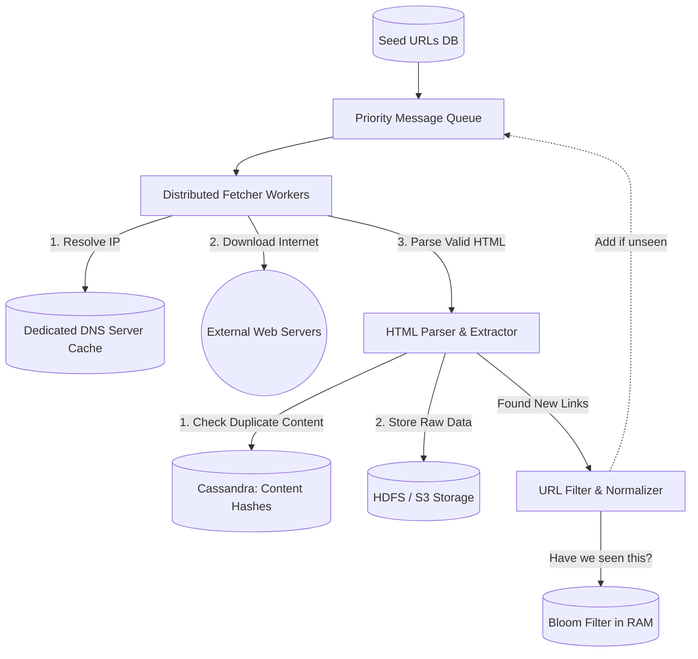

# 🕷️ Design a Scalable Web Crawler (Google Search)

**Core Domains:** Distributed Queueing, Graph Traversals, Large Scale Storage.  
**Primary Concepts Demonstrated:** Breadth-First Search (BFS), Bloom Filters, Politeness Strategies, DNS Caching.

---

## 1. Scope & Requirements
A web crawler is an incredibly unique system design problem because it heavily relies on algorithmic data structures (BFS/DFS) and external network courtesy (Politeness). The crawler's goal is to discover, download, and store the text of the entire internet.

*   **Traffic Focus:** Network Heavy. High outbound bandwidth, high inbound storage writes.
*   **Scale:** The internet has roughly 10 Billion indexed web pages.
*   **Storage (5 Years):** If an average webpage is $2 \text{ MB}$, $10B \text{ pages} \times 2MB = 20 \text{ PetaBytes}$. This requires massive distributed storage (HDFS/Cassandra).
*   **Latency constraint:** Not user-facing. Throughput (pages crawled per second) is vastly more important than latency.

---

## 2. Core Crawling Algorithm & The Frontier

A crawler is fundamentally a massive **Breadth-First Search (BFS)** graph traversal algorithm. 

1.  Start with a list of **Seed URLs** (e.g., `cnn.com`, `wikipedia.org`).
2.  Add them to a queue called the **URL Frontier**.
3.  Workers pull URLs from the Frontier, download the HTML, parse out all the hyper-links (`<a href>`).
4.  Add the newly discovered URLs back into the Frontier.
5.  Repeat ad infinitum.

### The "Spider Trap" Limitation
If a website dynamically generates infinite links (e.g., an infinite calendar where `year=2024` links to `2025` which links to `2026`), the crawler will get stuck forever, downloading infinite garbage data.
*   **Mitigation A:** **Maximum Depth limit**. If the URL path depth is > 10, discard it.
*   **Mitigation B:** **Content Hash Deduplication**. Hash the downloaded HTML. If the hash matches a page we already crawled, drop it.

---

## 3. High-Level Design (HLD)

---

## 4. Addressing System Bottlenecks

### A. "Have I Crawled This Before?" (The Bloom Filter)
When the parser extracts `https://amazon.com` from a webpage, it must ask: *Have we crawled this in the last 30 days?* If the answer is yes, we discard it to save bandwidth.

If we have 10 Billion URLs, checking a traditional Database (SQL/NoSQL) requires a disk seek. 10 Billion disk seeks will slow our crawler to a crawl. We must do this check in **RAM**. However, storing 10 Billion strings in RAM costs hundreds of gigabytes.

*   **Solution: The Bloom Filter.** A hyper-efficient array of bits. By running a URL through 3 distinct hashing algorithms (e.g., MurmurHash) and flipping bits from $0 \to 1$, we can map 10 Billion URLs into a few hundred Megabytes of RAM.
    *   *Limitation:* Bloom Filters have **False Positives** (it might incorrectly claim a new URL has been seen). But they *never* have False Negatives. Dropping 1% of the internet due to a false positive is an acceptable trade-off for $O(1)$ million-QPS memory speeds.

### B. Network Politeness (Don't DDOS the Internet)
If our highly scalable crawler fetches 10,000 pages from `small-server.com` concurrently, we will crash their server.
*   **Solution: The Politeness Strategy.** The URL Frontier is not purely Random (FIFO). It is a series of priority queues hashed by domain. 
    *   `Queue 1` only holds URLs for `apple.com`.
    *   `Queue 2` only holds URLs for `small-server.com`.
    *   A worker thread is pinned to a specific queue with a strict delay (e.g., `sleep(500ms)` between fetches to the same domain).

### C. The DNS Lookup Bottleneck
Before downloading a page, the fetcher must resolve `wikipedia.org` to an IP address (e.g., `198.35.26.96`). If a fetcher queries external DNS resolvers (like Google `8.8.8.8`) 1 Million times a second, the requests will be throttled or severely delayed ($>10ms$ each).
*   **Solution:** **Local DNS Caching**. We run dedicated DNS resolvers physically adjacent to our Fetcher Workers in the same subnet with huge in-memory IP tables, dropping resolution latency to $<1ms$.

---

## 5. Low-Level Design (LLD): Storage Structure

### HDFS Chunking for Small Files
Hadoop Distributed File System (HDFS) is designed for terabyte-sized files, not billions of 2MB HTML files. Storing billions of small files will exhaust the HDFS NameNode memory limit.
*   **Solution:** We stitch thousands of HTML pages together into massive `500MB` archive files (like Hadoop's SequenceFile or Parquet formats). We build a secondary index pointing to the exact byte offset of a specific webpage within the mega-file.
EOF
