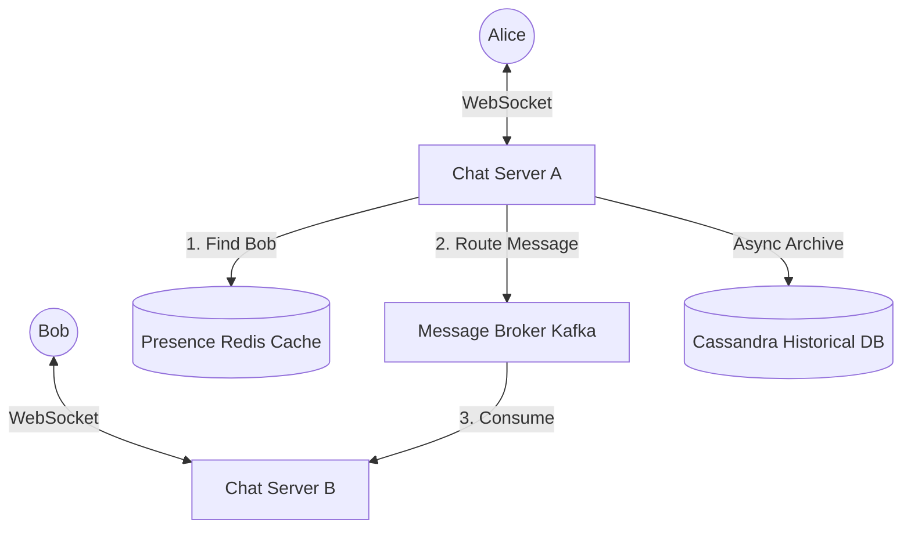
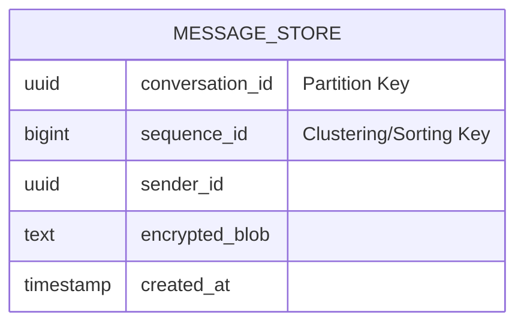

# 💬 Design a Real-Time Chat System (WhatsApp / Discord)

**Core Domains:** Persistent Connections, Bi-directional Communication, Presence Tracking.  
**Primary Concepts Demonstrated:** WebSockets, E2E Encryption, Message Ordering, Long-Polling vs Server-Sent Events.

---

## 1. Scope & Requirements
Building a chat application is the quintessential test of connection management. Unlike HTTP where a request opens, fetches, and closes instantly, a real-time chat requires millions of users to hold connections open indefinitely.

*   **Traffic Focus:** Extremely concurrent connections. Read and Write heavy.
*   **Scale:** 500 Million daily active users.
*   **Write Throughput:** 1 Million messages handled per second globally.
*   **Latency constraint:** Sub-second ($<100ms$) message delivery latency.

---

## 2. API Design & The "1 Million Connection" Problem
If 1 Million users open traditional HTTP 1.1 connections to your API server, the server will crash because standard Linux operating systems run out of Ephemeral Ports or RAM. 

To solve this, we use **WebSockets** (or gRPC streaming). WebSockets upgrade an HTTP request into a persistent, bi-directional, lightweight TCP connection. A single optimized backend machine (e.g., written in Erlang or Go) can hold 1 Million WebSockets open simultaneously with minimal RAM.

*   `sendMessage(sender_id, receiver_id, encrypted_content, timestamp)` (Sent via WebSocket)
*   `receiveMessage(sender_id, encrypted_content, timestamp)` (Pushed via WebSocket)

---

## 3. High-Level Design (HLD) & Routing
When Alice sends a message to Bob, Alice's phone is connected to **Chat Server A** in California. However, Bob's phone is connected to **Chat Server B** in New York. 

How does Server A know where Bob is to push the message?

### The Presence Service & Message Broker
We must track where every active user is connected in real-time.

1.  **Alice** sends a message to Server A.
2.  **Server A** queries the **Presence Service (Redis)** for Bob.
3.  Redis returns "Bob is on Server B".
4.  Server A drops the message onto a **Message Broker (Kafka/RabbitMQ)** addressed to Server B.
5.  **Server B** pulls the message and pushes it instantly down Bob's open WebSocket.

---

## 4. Addressing System Bottlenecks

### A. End-to-End Encryption (E2E)
Modern apps (WhatsApp/Signal) do not store plaintext messages in their Cassandra DBs. If a hacker breaches the database, they see nothing.
*   **Mechanism:** Signal Protocol (RSA / Elliptic Curve).
*   **Alice** requests Bob's Public Key from a dedicated Key Distribution Center (KDC).
*   Alice encrypts the `content` with Bob's Public Key locally on her phone.
*   The Chat Servers, Kafka, and Cassandra *only* see the encrypted blob.
*   Only **Bob's** private key (stored locally on his device device) can decrypt it.

### B. Message Ordering & Concurrency
If Alice sends "Hello" (Msg 1) and a microsecond later sends "How are you?" (Msg 2), they might arrive out of order if routed through different Kafka partitions.
*   **Limitation:** Relying on the server's timestamp is dangerous due to NTP clock drift across physical servers. Relying on the client's clock is dangerous because users can change their phone clocks.
*   **Solution: The Vector Clock or Sequence ID.** The server generates a globally unique, strictly increasing integer sequence (e.g., using Twitter Snowflake) right as the message hits the gateway. The client sorts the UI feed purely based on this Sequence ID.

### C. The Status Indicator (Last Seen / Online)
If 500 Million users broadcast a "Heartbeat Ping" every 2 seconds to prove they are `Online`, it translates to 250 Million writes per second. This will crash any database.
*   **Limitation:** You cannot use strict SQL updates for presence.
*   **Solution:** **Batched Cache approach.** The heartbeat hits a highly ephemeral Redis cluster updating a `Last_Active_Timestamp`. If a user wants to check Alice's status, they query Redis. If `CurrentTime - Last_Active_Timestamp > 10 Seconds`, they are deemed `Offline` or `Last Seen at X`.

---

## 5. Low-Level Design (LLD): Data Archival
Users expect to scroll back 5 years into their chat history.

*   **Choice:** **Wide-Column Store (Cassandra or HBase).**
*   **Why?** Chat is highly sequential and append-only. Cassandra writes are $O(1)$ and incredibly fast. We partition the data by `conversation_id` or `user_id_hash`.

*   By clustering the sequence ID, grabbing the "last 50 messages" is a lightning-fast contiguous sequential disk read instead of a scattered index lookup.
EOF
