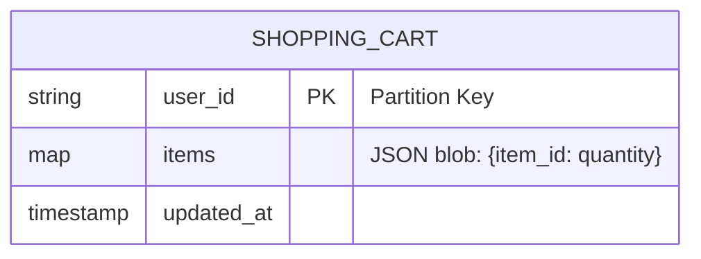
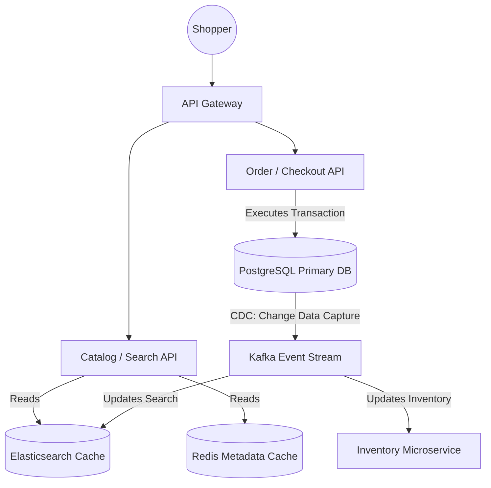

# 🛒 Design an E-Commerce Platform (Amazon)

**Core Domains:** Inventory Management, Shopping Cart State, Search.  
**Primary Concepts Demonstrated:** Distributed Locking, Eventual Consistency, CQRS (Command Query Responsibility Segregation).

---

## 1. Scope & Requirements
An e-commerce giant like Amazon has thousands of microservices, but the core system design interview focuses on three pillars: Product Search, the Shopping Cart, and Checkout/Inventory.

*   **Traffic Focus:** Extremely Read-Heavy (Browsing) vs Write-Spiky (Black Friday Checkout).
*   **Write Throughput:** 10,000 checkout orders per second at peak.
*   **Read Throughput:** 1 Million product detail views per second.
*   **Latency constraint:** Product pages must load in $<100\text{ms}$. Checkout can take a few seconds (Asynchronous).

---

## 2. API Design & The Shopping Cart LLD
The shopping cart is notoriously difficult to design because it sits in an awkward middle ground. It's not permanent data (most carts are abandoned), but it's highly transactional (you can't lose a user's items while they browse).

### Cart Storage Strategy: DynamoDB (NoSQL)
SQL is too rigid and heavy for millions of abandoned carts. We use a **Key-Value Store (Redis)** or **Wide-Column Store (DynamoDB)**.

*   **Conflict Resolution:** If Alice logs in on her phone and adds an iPad, then logs in on her laptop and adds an iPhone, how does the DB merge them?
    *   *Solution:* **Vector Clocks**. The cart DB maintains version history. When a conflict occurs, the system pushes the conflict to the client app, or simply performs a union (merges both items) rather than deleting one.

---

## 3. High-Level Design (HLD) & CQRS

In Amazon, you cannot read from the same database that handles checkout writes. If you do, a Black Friday checkout surge will crash the database, taking down the entire website's search and browsing capabilities.

This requires **CQRS (Command Query Responsibility Segregation)**. Write data (Orders) and Read data (Product Pages) live in physically different database architectures.

---

## 4. Addressing System Bottlenecks

### A. Inventory "Overselling" (Distributed Locks)
If Amazon only has 1 PlayStation 5 left in stock, and 10,000 users click "Buy" at the exact same millisecond:
*   **Limitation:** A standard SQL `UPDATE inventory SET stock = stock - 1` will result in negative stock if not locked.
*   **Solution: Redis Decrement & SQL Check constraint.**
    1.  Hold the live inventory count in Redis (`PS5_Stock: 1`).
    2.  Use Redis atomic operation `DECR PS5_Stock`. If it returns a value $< 0$, immediately fail the request.
    3.  If it returns $\ge 0$, proceed to the SQL database, which has a strict `CHECK (stock >= 0)` constraint, executing a final `SELECT ... FOR UPDATE` lock.

### B. Flash Sales (Thundering Herd)
During Prime Day, a single product (e.g., a $10 TV) gets 5 Million hits per second.
*   **Limitation:** Even Redis will crash if 5 Million connections hit a single node for the same key (a **Hot Partition**).
*   **Solution: Local Service Caching.** The Product API servers load the $10 TV metadata directly into their own local JVM/RAM. They serve the product page locally without ever making a network hop to Redis or SQL, shielding the backend entirely.

### C. Event Driven Architecture (Sagas for E-Commerce)
When a user checks out, we must: Charge the Card, Deduct Inventory, Notify the Warehouse, Send an Email.
Doing this synchronously in one HTTP request takes 15 seconds.
*   **Solution:** The Order API writes `Status: PENDING` to SQL, quickly returns `HTTP 200 OK` to the user, and fires an `OrderPlacedEvent` into Kafka. Completely separate microservices (Payment Svc, Notification Svc, Shipping Svc) listen to this Kafka topic and execute their duties asynchronously in the background.
EOF
