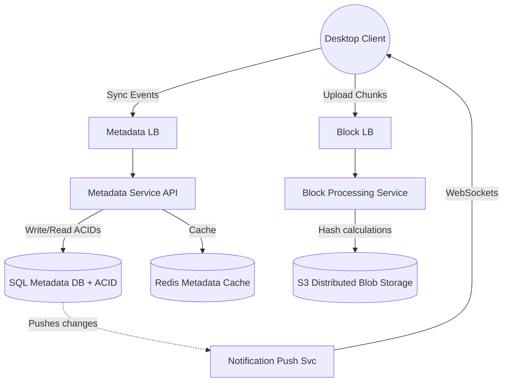
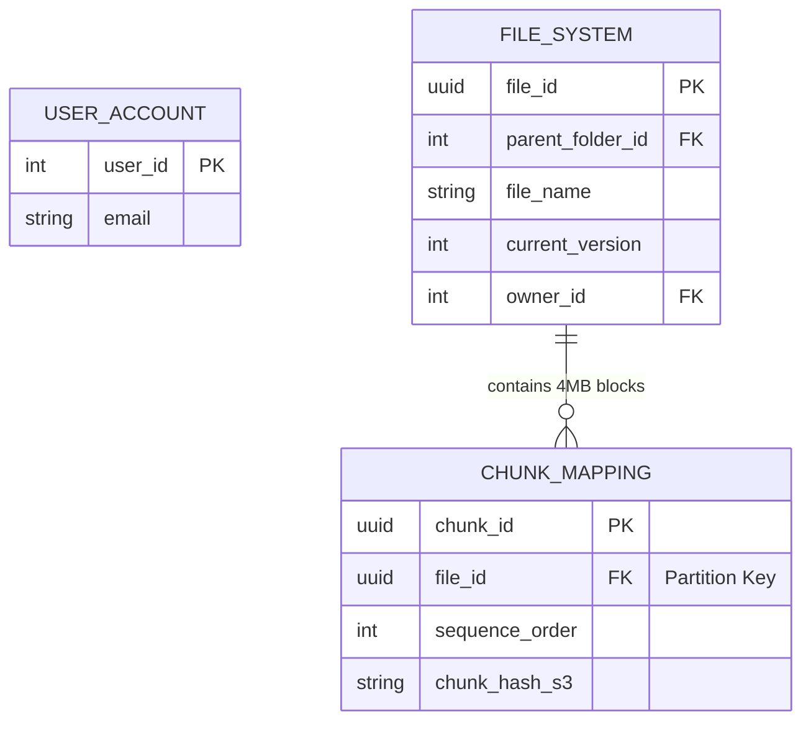

# ☁️ Design a File Storage & Sync Service (Google Drive / Dropbox)

**Core Domains:** Blob Storage, Desktop Syncing, Network Optimization.  
**Primary Concepts Demonstrated:** Block-level Rsync Chunking, Delta-Sync LLD, Distributed File Systems.

---

## 1. Scope & Requirements
Unlike YouTube where files are mostly read-only, Google Drive is intensely bi-directional. A user might work on a 1GB Photoshop file, clicking "Save" every 5 minutes. We cannot re-upload 1GB of data every 5 minutes—the user's bandwidth would be destroyed.

*   **Traffic Focus:** Heavy sustained Read/Write.
*   **Scale:** 1 Billion users, 50 PetaBytes of new data per month.
*   **Latency constraint:** Syncing must feel instantaneous. File consistency is paramount.

---

## 2. API Design & The "Chunking" Concept
If Alice adds a 1 Megabyte text layer to a 1 Gigabyte `design.psd` file and saves it, her Dropbox desktop client does not upload 1.001 GB.

Instead, the client breaks the file down into **Chunks** (e.g., $4$ MB blocks).
When Alice saves, the client calculates the SHA-256 hash of all 250 chunks. It compares them to the cloud. It realizes *only* Chunk #42 changed. The client uploads *only* that 4-megabyte chunk. This is known as **Block-level Rsync Chunking** or **Delta-Sync**.

### APIs (Long-Polling / WebSockets)
*   `uploadChunk(file_id, chunk_index, hash, byte_data)`
*   `downloadChunk(file_id, chunk_index, hash)`
*   `updateMetadata(file_id, new_version, user_id)`

---

## 3. High-Level Design (HLD)
To handle 50 PB/month, the metadata (names, folders, sharing permissions) must be strictly separated from the exact byte objects (the file contents).

---

## 4. Addressing System Bottlenecks

### A. The Offline / Online Collision Problem
Alice edits `file.txt` on her laptop while on an airplane (Offline). Bob edits the same `file.txt` on his computer at home (Online). Who wins when Alice connects to airplane WiFi?
*   **Solution: The Conflict File.** Unlike Google Docs (which uses CRDTs for real-time live cursors), Desktop Sync uses simpler versioning. The server accepts Bob's V2. When Alice reconnects and tries to upload her V2, the server rejects it. The client downloads Bob's V2 and renames Alice's version to `file (Alice's Conflicted Copy).txt`. 

### B. Scalable Cloud Storage Limitations (Amazon S3)
While S3 is "infinitely scalable", it is technically an Object Store, not a File System. You cannot "edit" an S3 object. You must replace it entirely.
*   **Limitation:** Writing a 1GB file requires a 1GB PUT request.
*   **Solution:** As discussed, we don't store "1GB files" in S3. We store $250 \times 4$MB chunks. Each chunk is a standalone S3 object named by its SHA-256 hash (e.g., `s3://bucket/a7bd9f...`). The SQL Metadata DB retains an ordered array mapping `file_id_99` $\to$ `[hash1, hash2, hash3... hash250]`.

### C. The Client-Side Polling Nightmare
If 1 Billion desktop apps ping the `/api/changes` endpoint every 10 seconds to check if a collaborator updated a file, the servers will face 100 Million QPS of empty `HTTP 200 Not Modified` responses. This will burn through AWS bandwidth billing.
*   **Solution:** **HTTP Long-Polling** or WebSockets. The client opens a connection and holds it. The server leaves the connection hanging for up to 60 seconds. If a change occurs, the server instantly replies with the change list. If 60s pass, the server replies `Empty`, and the client quietly reconnects.

---

## 5. Low-Level Design (LLD): The Metadata DB
Because metadata (folders, permissions, versions) requires strict ACID guarantees (you cannot have half a folder or corrupted permissions), we use a Relational DB (PostgreSQL / MySQL). To scale it to 1 Billion users, we Shard it.

### Key Optimizations
*   **Deduplication:** If two completely different users upload the exact same Top Gun MP4 movie, the hashes of their chunks will be identical. The Block Service realizes the `chunk_hash_s3` already exists on the AWS S3 drives. It simply adds a row to `CHUNK_MAPPING` linking User B's file to the existing hash, saving massive gigabytes.
*   **Cold Storage:** Older row revisions in the `CHUNK_MAPPING` table (versions from 3 years ago) are eventually swept into cheaper, slower storage tiers like Amazon S3 Glacier to cut costs.
EOF
