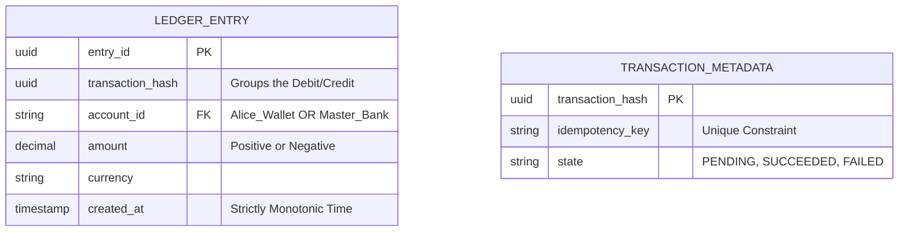

# 💳 Design a Payment Gateway (Stripe)

**Core Domains:** ACID Transactions, API Resiliency, Financial Reconciliation.  
**Primary Concepts Demonstrated:** The Saga Pattern (Distributed Transactions), Idempotency Keys, Exactly-Once Semantics, Double-Entry Bookkeeping.

---

## 1. Scope & Requirements
Designing a financial system is completely different from designing a social media site. In social media, dropping a "like" ($99.99\%$ reliability) is fine. In a payment system, dropping a $5,000 transaction is unacceptable. We require $100\%$ accuracy, guaranteed consistency, and strict auditability.

*   **Traffic Focus:** Low QPS (compared to Google Search) but extreme database stress.
*   **Write Throughput:** 5,000 transactions per second (TPS).
*   **Availability:** 99.999% (Must never drop a confirmed payment request).
*   **Consistency:** Strict ACID. No Eventual Consistency.

---

## 2. API Design & The Idempotency Key
If an e-commerce website sends `POST /v1/charges {amount: 50.00, user: Alice}` and the network connection physically drops mid-flight resulting in an HTTP 504 Timeout, the e-commerce site doesn't know if Stripe charged Alice or not. If it retries, it might accidentally charge her $100.

### The Idempotency Law
An operation is *idempotent* if performing it multiple times yields the exact same state as performing it once.
*   Stripe forces the client to pass an `Idempotency-Key` header (usually a V4 UUID) for every destructive POST request.
*   **API:** `POST /v1/charges (Header: Idempotency-Key: a1b2c3...)`

If Stripe receives `a1b2c3` on Monday, processes it successfully ($200 OK), and then the client's retry script forces `a1b2c3` again on Tuesday, Stripe instantly intercepts it. The system queries the `idempotency_table`, sees `a1b2c3` already resulted in `$50 Success`, and just returns the exact same historical JSON body without touching Alice's credit card again.

---

## 3. High-Level Design (HLD): The Saga Pattern
A transaction often spans multiple microservices (e.g., Risk/Fraud Service, Ledger Service, External Visa Bank).

You cannot use a simple blocking `SQL BEGIN...COMMIT` across three distinct servers. Instead, we use a distributed transaction pattern known as the **Saga Pattern (Orchestrator)**.

```mermaid
graph TD
    Merchant((Merchant UI)) -->|POST /charges| LB[Load Balancer]
    LB --> Gate[API Gateway]
    
    Gate -->|1. Validate Key| IdempDB[(Idempotency DB)]
    Gate -->|2. Start Saga| Maestro[Payment Orchestrator]
    
    Maestro -->|Step 1. Risk Check| FraudSvc[Fraud Service]
    Maestro -->|Step 2. Internal Ledger| LedgerSvc[Ledger DB (ACID)]
    Maestro -->|Step 3. HTTP Call to Visa| BankGateway[External Bank API]
    
    BankGateway -.->|Success: $50 Auth| Maestro
    Maestro -->|Step 4. Finalize state| LedgerSvc
    Maestro -->|Step 5. Commit| LedgerSvc
```

### The Compensating Transaction
If Step 3 (Visa API) returns `Declined (Insufficient Funds)`, the Orchestrator cannot simply throw an error. It must reverse Step 2 (Internal Ledger).
The Saga Orchestrator executes a **Compensating Transaction**: `Refund Ledger -$50` to maintain atomic state globally across the microservices.

---

## 4. Addressing External API Limitations
Calling the Visa/Mastercard HTTP APIs is the slowest and most unreliable part of the architecture. Their servers might take 10 seconds to respond or go down entirely.

### A. Circuit Breaker Pattern
If the Visa API dies, holding 5,000 open web threads mathematically guarantees your API Gateway will crash due to thread exhaustion.
*   **Solution:** When the timeout failure rate exceeds $50\%$ in 10 seconds, the Circuit Breaker "opens". The Orchestrator instantly short-circuits and fails the payment locally (`503 Visa Downtime`), protecting Stripe's internal infrastructure from cascading thread exhaustion. It periodically tests the connection ("Half-Open") before closing the circuit again.

### B. Async Webhooks (The "Payment Intent")
Because the bank might require 3D-Secure 2FA SMS verification, a simple blocking `POST` is terrible UX.
*   **Solution:** Stripe creates a `PaymentIntent` in a `PENDING` state and instantly returns `HTTP 202 Accepted` to the merchant.
*   Stripe polls the bank asynchronously.
*   When the bank confirms, Stripe fires an async HTTP JSON **Webhook** `POST /stripe-webhook` back to the Merchant's server: "Payment Intent Successful".

---

## 5. Low-Level Design (LLD): Double-Entry Bookkeeping
A payment ledger cannot simply be a row that says `Alice Balance: $50`. If there's a bug that sets it to `$0`, that money vanishes into thin air.

*   **Rule:** The Ledger is strictly **Append-Only Immutable**.
*   **Rule:** Every transaction creates exactly two lines that must sum to $0$.



*Example Ledger Row 1:* `Debit Alice Wallet: -$50.00`
*Example Ledger Row 2:* `Credit Merchant Wallet: +$48.50`
*Example Ledger Row 3:* `Credit Stripe Fee Sink: +$1.50`
*(Sum always equals $0$)*


---

## 6. Frequently Asked Hard Interview Questions
**Q: What happens if a user requests a refund of $20, but the original charge was $50? How does the Idempotency System and Ledger handle partial refunds?**
*Answer:* The Ledger is immutable. We never update the `$50` row. A Refund is a completely brand new Transaction with its own unique `Idempotency-Key` (e.g., `refund_req_333`). The Ledger creates a new row: `Debit Merchant: -$20, Credit User: +$20` linked to the `Original_Transaction_ID` via a Foreign Key constraint. An aggregation view queries `SUM(amount) WHERE parent_id = X` to verify the total refunds never exceed the original `$50`.

**Q: How do you achieve 99.999% availability if the entire AWS us-east-1 region physically goes completely offline?**
*Answer:* Complete Active-Active Multi-Region redundancy via **CockroachDB / Google Spanner (Distributed SQL)**. Standard Postgres is Active-Passive, meaning cross-region failovers take precious minutes. Using a globally synchronized True-Time database means transactions are written to multiple geographic regions synchronously using the Paxos or Raft consensus algorithms. If a region burns down, the API gateway seamlessly routes to another region where the Ledger is perfectly intact with zero data loss ($RPO = 0$).
