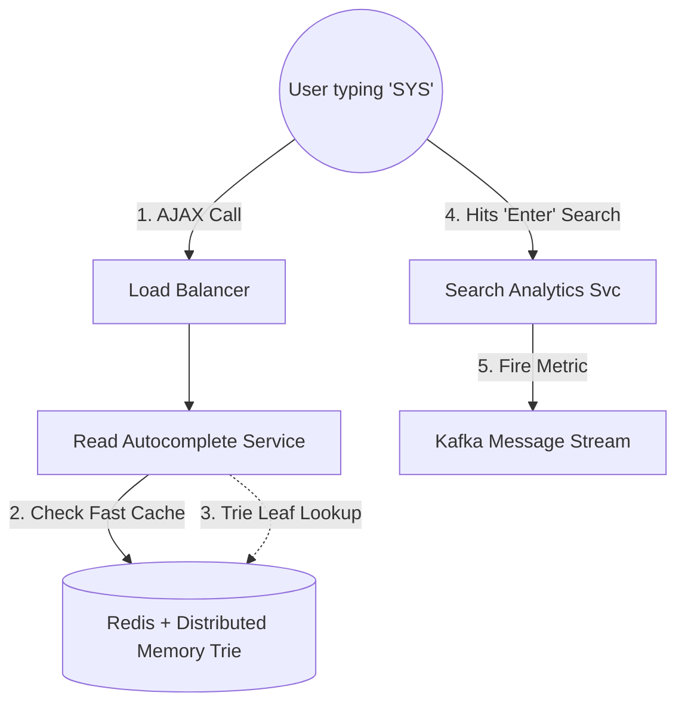
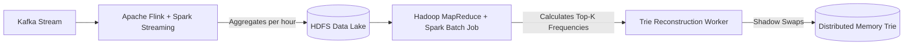

# ⌨️ Design an Autocomplete System (Typeahead Search)

**Core Domains:** Specialized Data Structures, Batch Data Pipelines.  
**Primary Concepts Demonstrated:** Distributed Tries, Top-K Frequent Items, Apache Spark / Flink Aggregation.

---

## 1. Scope & Requirements
When a user types "S-Y-S..." into Google, the system must instantly return the 5 most popular query completions globally ("System Design", "System of a Down", "Systolic Blood Pressure"). 

*   **Traffic Focus:** Extremely Read-Heavy with immense Latency Constraints.
*   **Write Throughput:** 1 Billion searches executed per day (Used to update search volume metadata).
*   **Read Throughput:** We query the system every single time a user types a character. If 100,000 distinct users are typing "System" character-by-character, that's 600,000 requests. Roughly 1 Million QPS.
*   **Latency constraint:** Must return suggestions within $<50\text{ms}$. If it is slower than human typing speed (~150ms per keystroke), the feature is completely useless.

---

## 2. Naive Database Attempt (The Bottleneck)
The naive approach is simply placing all queries in a SQL DB and running:
`SELECT query FROM search_history WHERE query LIKE "sys%" ORDER BY frequency DESC LIMIT 5;`

**Why this fails:**
A `LIKE "sys%"` query on 10 Billion rows, even with indexing, requires scanning the index tree and sorting 500,000 matching results by frequency on the fly. Doing this 1 Million times a second will destroy a Relational Database.

---

## 3. The Data Structure: The Distributed Trie
To achieve sub-50ms latency, we must use a specialized tree structure cached entirely in memory (RAM).
A **Trie (Prefix Tree)** is a tree where each node represents a character.

### Trie Structure & Caching
Root $\to$ `S` $\to$ `Y` $\to$ `S`
*   Instead of traversing all the way down every leaf node starting with "SYS" to find the most popular, we pre-compute the answers.
*   The node for `SYS` actively caches the Top 5 most frequent search queries derived from its children (`System Design (99M)`, `System Information (40M)`).
*   *Time Complexity:* $O(1)$ lookup for the letter, $O(1)$ to return the pre-computed Top-5 list. The retrieval is practically instantaneous.

---

## 4. High-Level Design (HLD): The Read & Write Paths

The system is definitively split into two halves: The blazing-fast Read Path (serving autocomplete suggestions), and the slow, heavy Write Path (aggregating billions of analytics events to rank the suggestions).

### The Analytical Write Pipeline (Big Data)
We don't update the Trie on every single search. It would cause massive write amplification and lock-contention on the Trie nodes.
Instead, we batch the data.

---

## 5. Overcoming Scale Limitations

### A. The "Trending" Problem (Stale Caches)
If a major news event happens (e.g., a viral celebrity scandal), people start searching for it immediately. If our `Hadoop MapReduce` job only runs once a week, the autocomplete won't catch the trending topic until next Monday.
*   **Limitation:** Batch processing is structurally incompatible with real-time virality.
*   **Solution:** **Stream Processing Integration.** While Hadoop runs weekly baseline aggregations, Apache Flink maintains a rolling window (e.g., last 15 minutes) of search frequencies in real-time. The Read API pulls the 5 items from the massive static Trie, and the 5 items from the Flink trending cache, merges them on the fly, and returns the highest combined weight to the user.

### B. Distributed Trie Sharding
When your Trie holds $200$ GB of English text, it exceeds the RAM limits of a single Redis server (typically capped comfortably around 32-64GB to prevent severe Garbage Collection/RDB dump pausing). You must shard the Trie.
*   **Limitation:** If you shard purely based on $A-Z$ (Server 1 gets A-H, Server 2 gets I-Z), you face significant "Hotspotting." `S` (System, Star Wars, Selena) generates $1000\times$ more load than `X` (X-ray, Xylophone).
*   **Solution:** **Consistent Hashing by Prefix.** We don't shard geographically or alphabetically. We hash the first two characters (e.g., `hash("sy") % 100`). This perfectly balances the load across 100 Redis shards, guaranteeing Node 1 and Node 99 do exactly the same amount of work, solving the "Zipf's Law" skew.

---

## 6. Real-World API Optimizations
1. **Client-Side Debouncing:** A user types `S` (wait), `y` (wait), `s`. Instead of firing an HTTP request instantly per character, the Javascript client "debounces" logic. It waits 100ms after a keystroke. If the user hits the next key quickly, it cancels the previous outgoing HTTP request. This slashes backend load by $50\%$.
2. **Local Browser Caching:** When a user types `S`, the browser downloads the top 50 suggestions for `S` locally. When the user types `S` then `y`, the browser does *not* hit the backend. It checks the local array first.

---

## 7. Frequently Asked Hard Interview Questions
**Q: How do you handle multi-language/localization? A user in Tokyo typing "App" shouldn't see "Applebee's Menu".**
*Answer:* Tries are heavily partitioned by Region/Locale. You do not just build one massive global Trie. You build `Trie_US_EN`, `Trie_JP_JA`, etc. The Load Balancer looks at the User's `Accept-Language` header and GeoIP data to route the query to the hyper-specific regional instance of the Autocomplete service, drastically improving relevance and reducing the memory footprint per instance.

**Q: A user routinely searches for highly specific obscure things (e.g., a specific database ID). How do you personalize their autocomplete if the global Trie only cares about the Top 5 most searched words?**
*Answer:* **Federated Search at the Edge.** The browser/client app stores a local SQLite or indexedDB cache of the user's specific history. When they type 3 letters, the API provides the 5 global completions, but the localized app dynamically overrides or injects the personalization locally on the device, eliminating the need to store 1 Billion personalized micro-Tries in the main backend memory.
