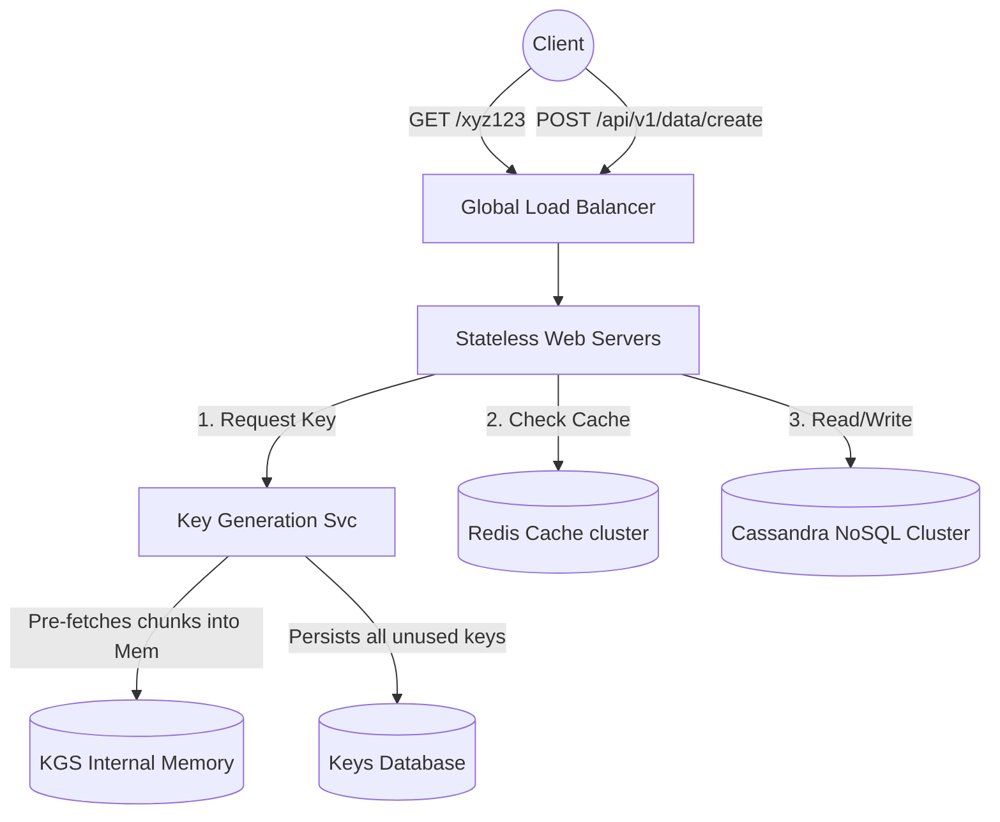

# Design 1: URL Shortening Service (Bitly / TinyURL)

URL shortening services create shorter aliases for long URLs. When users click these short links, they are redirected to the original URL. Let's design a highly scalable version capable of handling billions of links.

---

## 1. Clarification & Requirements

Before designing, we must constrain the problem.

### Functional Requirements
1.  **Shortening:** Given a long URL, return a much shorter, unique alias.
2.  **Redirection:** When accessing a short link, redirect the user to the original long URL.
3.  **Custom Aliases:** Users can optionally pick a custom short link.
4.  **Expiration:** Links expire after a default timespan (e.g., 5 years) but users can specify an expiration time.

### Non-Functional Requirements
1.  **Highly Available:** If the service goes down, all URL redirections across the internet fail. High availability is non-negotiable.
2.  **Scalable & Fast:** URL redirection must have minimal latency in real-time.
3.  **Read-Heavy:** It is safe to assume the ratio of read requests to write requests is 100:1.

---

## 2. Back-of-the-Envelope Estimation

Let's assume the service handles **100 Million new URL shortenings per month**.

*   **Read Traffic (Redirections):** `100M writes * 100 (ratio) = 10 Billion reads / month.`
*   **Write QPS:** `100M / (30 days * 24h * 3600s) = ~40 URLs / second.`
*   **Read QPS:** `10B / (30 days * 24h * 3600s) = ~4,000 requests / second.`

### Storage Estimates
If we store URLs for 5 years:
`100M URLs/month * 12 months * 5 years = 6 Billion records total.`
Assume each record takes 500 Bytes (Hash + Long URL + metadata).
`6 Billion * 500 Bytes = 3 Terabytes (TB) of storage.`

### Memory (Cache) Estimates
We should cache 20% of the daily traffic (Pareto principle: 20% of URLs generate 80% of traffic).
*   *Daily Reads:* `10B / 30 = ~330 Million requests per day.`
*   *Cache Memory:* `20% * 330M * 500 Bytes = ~33 Gigabytes (GB) of memory required.`
*   33 GB fits easily into a modern Redis instance.

---

## 3. System API Design

We expose RESTful APIs:
1.  `create_url(api_dev_key, original_url, custom_alias=None, user_name=None, expire_date=None)`
    *   *Returns:* HTTP 201 (Created) and the short URL `https://tiny.url/xyz123`.
2.  `get_url(short_url_alias)`
    *   *Returns:* HTTP 302 (Found) Redirect to the original URL.
3.  `delete_url(api_dev_key, short_url_alias)`

---

## 4. The Core Logic: URL Encoding

How do we generate a unique, short, 7-character string?

### Approach 1: Convert URL to Hash (MD5 or SHA256)
Compute the MD5 hash of the original URL (which generates a 128-bit hash value), then Base64 encode it. Because Base64 contains 64 characters `[A-Z, a-z, 0-9, +, /]`, it translates 128 bits into a 22-character string. We only need 7 characters, so we take the first 7.

*   *The Fatal Flaw (Collisions):* What if two users submit the exact same Google Drive link? They get the same hash. Worse, what if taking the first 7 characters of two totally different URLs yields the same string? We must hit the DB, realize it exists, append a random string to the URL, and hash it again. This is terribly inefficient and requires constant DB lock-checking.

### Approach 2: Key Generation Service (The Industry Standard)
Instead of hashing URLs on the fly, we build a standalone **Key Generation Service (KGS)**.
1.  The KGS runs independently. It generates random 7-character Base62 strings and stores them in a database Table (`unused_keys`).
2.  When the Web Server receives a request to shorten a URL, it doesn't compute any hashes. It simply asks the KGS for one of the pre-generated, guaranteed-unique keys.
3.  The KGS marks that key as "used" and returns it to the Web Server.

**Why is 7 Characters enough?**
Base62 encoding `[A-Z, a-z, 0-9]`.
`62 characters ^ 7 slots = ~3.5 Trillion unique combinations`.
We only need 6 Billion combinations for 5 years, so 7 characters is vastly more than enough space.

---

## 5. Database Architecture

We have 3TB of data. A single SQL server *could* hold 3TB, but for a scalable Internet-wide service, NoSQL is the superior choice because we need massive horizontal scaling for Read/Write QPS and we do not need complex relational joins between URLs and their owners.
*   **Choice:** **Amazon DynamoDB or Apache Cassandra (Wide-Column Key-Value NoSQL).**

### Data Schema
**Table: URL_Mapping**
*   `short_url` (varchar(7) Primary Key - Hash Key)
*   `original_url` (varchar(2048))
*   `created_at` (datetime)
*   `expiration_length_in_minutes` (int)
*   `user_id` (int)

**Table: User**
*   `id` (int Primary Key)
*   `name` (varchar(50))
*   `email` (varchar(50))
*   `creation_date` (datetime)

---

## 6. High-Level Design (Mermaid Diagram)

---

## 7. Deep Dive: Handling Edge Cases & Scaling

### A. The KGS Concurrency Problem (Single Point of Failure)
If there are 50 Web Servers hitting the KGS for a new key, how do we prevent the KGS from giving the *exact same* unused key to two different Web Servers simultaneously?
*   **The Fix (Chunking via Zookeeper):** We run multiple instances of the KGS to prevent a SPOF. We use Apache Zookeeper to manage the cluster. Zookeeper hands out "Chunks" of keys. KGS Instance A gets keys `1 to 100,000`. KGS Instance B gets `100,001 to 200,000`. The KGS instances load these chunks into their local RAM and hand them out instantly without needing complex distributed locks.

### B. Traffic Spikes (The Justin Bieber Problem)
What if a celebrity tweets a short URL, causing 10,000 requests per second to that single link?
*   **The Fix (Aggressive Caching):** Cassandra handles writes beautifully but we need Redis to handle the 4,000+ Read QPS. We implement an **LRU (Least Recently Used) Cache-Aside pattern**.
    1.  Web Server checks Redis for `xyz123`.
    2.  If Miss, Web Server pulls from Cassandra, adds it to Redis, then redirects the client.
    3.  When the celebrity tweets, the first request is slow (50ms). The next 9,999 requests in that second pull directly from Redis RAM (<1ms).

### C. Data Partitioning / Sharding the Database
As Cassandra grows past 5TB, we must shard the data.
*   **Shard Key:** We use the `short_url` as our Partition Key. `hash(short_url) % 256_servers`.
*   **Hashing Methodology:** We absolutely must use **Consistent Hashing** (Hash Ring with virtual nodes) to distribute the 3.5 Trillion key combinations evenly across our Cassandra nodes. If we add a new Cassandra node, Consistent Hashing ensures we don't have to move 90% of our data.

### D. Expiration & Cleanup
How do we delete expired URLs? Running a daily SQL cron job (`DELETE FROM db WHERE expire_date < NOW()`) on 6 Billion rows will completely crash the database.
*   **The Fix (Lazy Cleanup):** We do mostly passive cleanup.
    1.  If a user requests an expired URL, we return an error ("URL Not Found"), and *at that moment*, we actively delete the record from the DB and Cache.
    2.  As a background process, we run a very slow, low-priority Lambda worker that crawls the DB continuously during non-peak hours, deleting ancient items incrementally.
