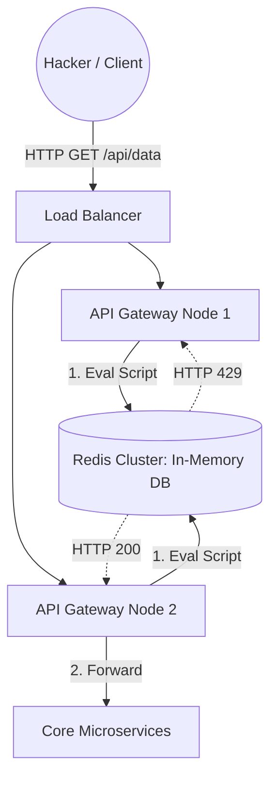

# 🚦 Design an API Gateway Rate Limiter

**Core Domains:** API Defense, Middleware, Distributed Counters.  
**Primary Concepts Demonstrated:** Token Bucket, Leaky Bucket, Sliding Window algorithms, Redis Lua Scripting.

---

## 1. Scope & Requirements
A Rate Limiter defends backend microservices from DDOS attacks, brute-force login attempts, and massive traffic spikes. It sits at the absolute edge of the network.

*   **Traffic Focus:** Immense Read/Write (Check and Decrement) on counters.
*   **Throughput:** 10 Million requests evaluated per second globally.
*   **Latency constraint:** Evaluating if a request is allowed must take $<5\text{ms}$. It is in the critical path of *every* API call.

---

## 2. Rate Limiting Algorithms
You must choose an algorithm that mathematically models your API's intention.

### A. Token Bucket (The Industry Standard - Amazon API Gateway)
A bucket holds $N$ tokens (e.g., 5 tokens). Tokens are refilled at a set rate (e.g., 1 token per second). Every API call removes 1 token. If the bucket is empty, the request is dropped (`HTTP 429 Too Many Requests`).
*   *Pros:* Memory efficient. Allows brief bursts of traffic (e.g., user fires 5 requests instantly, then gets throttled).

### B. Fixed Window Counter
Counts requests from `12:00:00` to `12:01:00`. (e.g., Max 100 per minute).
*   *Limitation:* **The Boundary Spike Problem**. A user could send 100 requests at `12:00:59` and 100 requests at `12:01:01`. They successfully bypassed the limit, hitting the server with 200 requests in 2 seconds.

### C. Sliding Window Log / Sliding Window Counter (Cloudflare)
Keeps a rolling log of exactly when requests occurred. Fixes the boundary spike problem perfectly but is memory heavy (forces you to store millions of UNIX timestamps in Redis).

---

## 3. High-Level Design (HLD): Redis Integration
Because the rate limiter sits across a cluster of 500 API Gateway servers, the counters must be decentralized but universally synchronized.

---

## 4. Low-Level Design (LLD): The Redis Race Condition

If you implement the Token Bucket algorithm poorly, you will hit a severe concurrency bug.
If the API Gateway code looks like this:
1.  `GET tokens from Redis` (Returns 1)
2.  `If tokens > 0, DECREMENT by 1`
3.  `SET tokens to Redis`

If 5 requests hit 5 different Gateways at the exact same millisecond, they will all execute step 1 and see `tokens = 1`. They will all allow the request, and the rate limiter is bypassed.

### The Solution: Redis LUA Scripting
To fix the race condition, the `GET`, `COMPARE`, and `SET` operations must be executed **Atomically**. 
We write a tiny **Lua Script** and load it directly into the Redis engine. Redis is single-threaded; it will execute the entire Lua script as one uninterrupted atomic step, guaranteeing perfect mathematical precision even under DDOS loads.

---

## 5. Overcoming Scale Limitations

### A. The Redis Bottleneck
At 10 Million QPS, even a clustered Redis setup might struggle with sheer connection volume just to evaluate limits.
*   **Limitation:** A network hop to Redis adds 2-3ms of latency to *every single API call*.
*   **Solution: Local Memory + Eventual Consistency (The Hybrid Approach).** 
    Instead of checking Redis on every request, the API gateway utilizes local RAM (`ConcurrentHashMap` in Java or `sync.Map` in Go). It evaluates the limits locally. Every few seconds, it syncs its local counters with the global Redis cluster.
    *   *Trade-off:* The rate limiter is slightly "loose" (it might let 105 requests through instead of exactly 100), but performance increases by $1000\times$.

### B. Distributed Denial of Service (DDoS)
If an attacker sends 50 Million requests a second, the API Gateway evaluating 50 Million Lua scripts will run out of CPU and crash, bringing the whole site down.
*   **Solution: Edge Throttling (Cloudflare / AWS Shield).** You cannot solve a Layer 4 DDoS at the Application (Layer 7) Gateway. You must integrate BGP null-routing or rely on a massive CDN edge network (e.g., Cloudflare) to physically swallow the malicious packets before they ever reach your AWS VPC.
EOF
