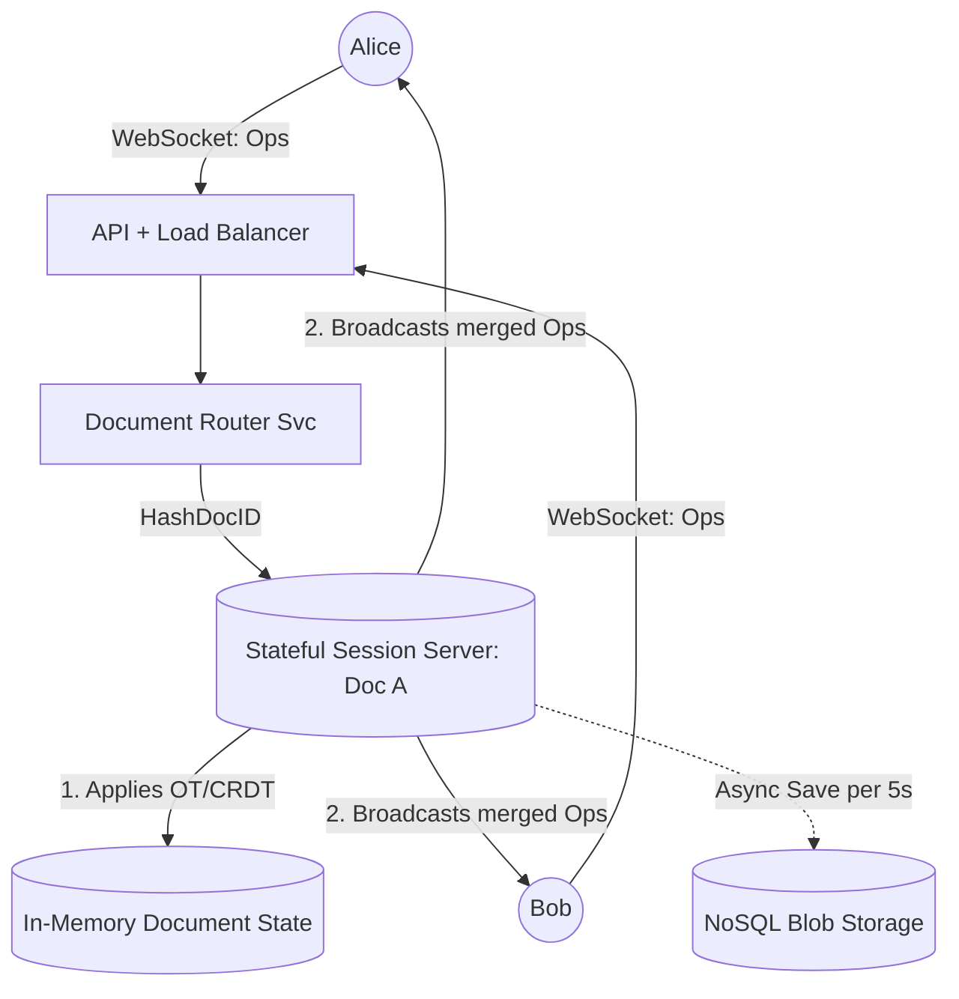

# 📝 Design a Collaborative Editor (Google Docs / Figma)

**Core Domains:** Real-Time Synchronization, Operational Transformation, Concurrency Control.  
**Primary Concepts Demonstrated:** CRDTs (Conflict-free Replicated Data Types), Operational Transformation (OT), WebSockets, State Machines.

---

## 1. Scope & Requirements
Building a collaborative editor is arguably one of the most mathematically complex system design challenges. When Alice and Bob edit the same sentence simultaneously, how does the system merge their keystrokes without corrupting the document?

*   **Traffic Focus:** High concurrency, small continuous payload writes (WebSockets).
*   **Scale:** Millions of concurrent users globally editing 100,000 active documents.
*   **Latency constraint:** Keystrokes must appear on all peers' screens in $<50\text{ms}$ to feel like real-time typing.

---

## 2. API Design & The Concurrency Bottleneck

### The Race Condition of Typing
Imagine the document contains the text: `CAT`.
*   **Alice** deletes the `C` (Index 0). She expects the document to be `AT`.
*   **Bob** simultaneously inserts an `S` at Index 3. He expects the document to be `CATS`.

If Alice's computer sends `Delete(Index 0)` to the server, and Bob's computer sends `Insert("S", Index 3)` to the server, what happens when the network delivers Bob's packet to Alice?
*   Alice applies the deletion locally: `CAT` $\to$ `AT`.
*   Alice receives Bob's command: `Insert("S", Index 3)`.
*   Alice tries to apply it to `AT`, but `AT` only has indices 0, 1, and 2. Index 3 is out of bounds! The program crashes or corrupts the text.

You cannot use standard PostgreSQL rows to edit at this granularity.

---

## 3. High-Level Design (HLD)

The foundation of Google Docs is a clustered WebSocket hierarchy where every active document is assigned a single authoritative "Session Server" (a stateful node).

---

## 4. The Algorithm: OT vs CRDTs

To solve the typing race condition, the industry uses two competing mathematical models.

### Approach A: Operational Transformation (OT) - *The Google Docs Approach*
OT relies on a Centralized Server to transform mathematical indices.
*   When Alice sends `Delete(Index 0)`, the Server applies it locally: `AT`.
*   When the Server subsequently processes Bob's delayed packet `Insert("S", Index 3)`, the Server realizes Alice just shifted the indices by $-1$.
*   The Server **Transforms** Bob's operation: `Insert("S", Index 3)` $\to$ `Insert("S", Index 2)`.
*   It applies the transformed operation: `ATS` (which is contextually correct).
*   *Limitation:* OT is incredibly hard to scale horizontally because it explicitly requires a single Centralized Server to act as the ultimate ground-truth referee for a specific document.

### Approach B: CRDTs (Conflict-free Replicated Data Types) - *The Figma / Modern Approach*
CRDTs eliminate the need for a Central Server to transform indices by entirely abandoning numerical indices like `[0, 1, 2]`.
*   Instead of positioning letters at `Index 1`, every single letter in a CRDT document receives a universally unique, fractional ID.
    *   `C` is ID `0.100`
    *   `A` is ID `0.200`
    *   `T` is ID `0.300`
*   If Bob inserts `S` between `A` and `T`, his computer assigns the `S` an ID exactly halfway between them: `0.250`.
*   If Alice deletes `C` locally, she simply broadcasts `Delete(0.100)`.
*   **The Magic:** Because every character has an absolute, globally unique floating-point ID, position shifts do not matter. The operations are mathematically *Commutative* (Order of arrival doesn't matter). Peer-to-peer editing works flawlessly without a central server mathematically checking the index state.
*   *Limitation:* CRDT memory overhead is massive. A 100KB text file might consume 20MB of RAM because every single character carries complex GUIDs and fractional math metadata.

---

## 5. Overcoming Scale Limitations

### A. Zombie WebSockets (Presence)
When a user closes their laptop lid, the WebSocket doesn't explicitly send a "Disconnect" packet. It leaves a "Zombie Connection".
*   **Mitigation:** The Stateful Session Server implements a Server-side ping mechanism (Heartbeats). It pings Alice every 10 seconds. If Alice doesn't reply `PONG` in 30 seconds, the server forcefully closes the socket, removes her cursor from Bob's screen, and frees the RAM.

### B. Bootstrapping Large Documents
If a document is 500 pages long (e.g., a 10MB JSON OT blob), when Charlie joins the session, he cannot wait 30 seconds to download the entire operation history from the server.
*   **Limitation:** Replaying 1 Million keystrokes to establish the current state.
*   **Mitigation:** **State Snapshots.** The server periodically creates compressed snapshots of the finalized text every 5 seconds and saves them to Amazon S3. When Charlie connects, he instantly fetches the most recent snapshot from the CDN ($>99\%$ caught up), and the Session Server only streams him the operations that occurred in the last few seconds to fill the gap.

---

## 6. Frequently Asked Hard Interview Questions
**Q: How does the "Undo/Redo" stack work mathematically with CRDTs when 5 people are editing? If Alice clicks "Undo", whose action is undone?**
*Answer:* In a collaborative environment, the concept of a "Global Undo" is chaotic. If Alice types A, Bob types B, and Alice hits Undo, we only want to undo Alice's "A", leaving "B" intact. Every operation tracked in the CRDT carries an `Author_ID`. Alice's local machine maintains her *Personal Undo Stack*. When she hits Undo, she is physically issuing an entirely new CRDT operation: `Delete(Author: Alice, Action: 12)`. The CRDT mathematically nullifies her previous action without disrupting Bob.

**Q: A user edits a document aggressively on an airplane with no WiFi. They connect 10 hours later. What happens?**
*Answer:* The local browser caches all hundreds of CRDT operations systematically in IndexedDB. Because CRDT fractional indices do not rely on a strictly sequenced central server state, when the user connects, their client blasts the batch of 500 queued operations to the central server. The server instantly resolves them because the fractional positional logic mathematically merges perfectly (Commutative Property) regardless of how old the offline time-gap was.
