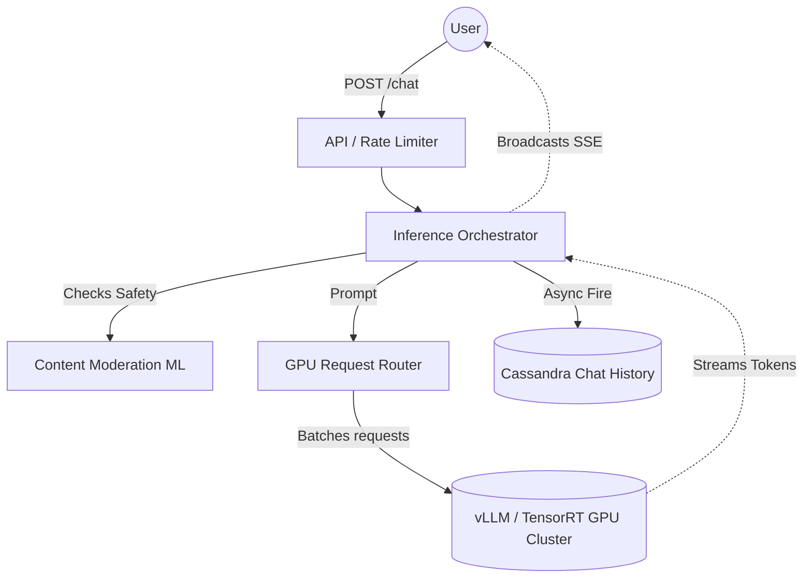

# 🤖 Design an LLM Inference Architecture (ChatGPT)

**Core Domains:** GPU Clustering, Token Streaming, AI Acceleration.  
**Primary Concepts Demonstrated:** LLM Inference, vLLM / TensorRT-LLM, Token Batching, KV Cache Memory Limits.

---

## 1. Scope & Requirements
Unlike traditional web systems where an API call checks an SQL database and returns in 10ms, an LLM Inference call requires locking massive GPU clusters, streaming output chunk by chunk, and executing insanely fast matrix multiplications.

*   **Traffic Focus:** Extremely Compute (GPU) and Memory Bandwidth Heavy.
*   **Scale:** Millions of active chats.
*   **Latency constraint:** Time-To-First-Token (TTFT) must be $<300\text{ms}$ or the user thinks it's broken. The Generation Speed must be faster than human reading speed ($\approx 25$ tokens per second).

---

## 2. API Design & The "Streaming" Paradigm
A standard REST API `POST /v1/chat/completions` that returns the whole answer in one massive JSON blob is unacceptable. Generating 1,000 words takes an LLM 30 seconds. A browser will time out.

We must rely on **Server-Sent Events (SSE)** or HTTP Chunked Transfer Encoding.

*   **Flow:**
    1.  Client submits the prompt.
    2.  Server returns `HTTP/1.1 200 OK` instantly, holding the connection open.
    3.  As the GPU generates the first word ("The"), the server streams it via SSE to the Javascript DOM.
    4.  The server streams words continuously until the `<EOS>` (End Of Sequence) token is generated.

---

## 3. High-Level Design (HLD): The AI Orchestration

---

## 4. Addressing Severe AI Bottlenecks

### A. The GPU Memory Limit (The KV Cache Problem)
When generating long conversations, an LLM doesn't just read the current prompt. It reads the entire history. Calculating the self-attention mechanism on a $32,000$ token context window requires immense GPU VRAM (Memory), not just compute.
This intermediate memory used to remember previous words is called the **KV Cache** (Key-Value Cache).

*   **Limitation:** A modern $8\times\text{H100}$ GPU node has $640$ GB of combined VRAM. If 1,000 users ask long questions simultaneously, the KV Cache for all those users will exceed 1,000 GB, immediately crashing the physical server with an Out-Of-Memory (OOM) error.
*   **Solution: PagedAttention (vLLM).** vLLM is an engine that treats the GPU VRAM exactly like an Operating System treats RAM (Virtual Memory Paging). It chunks the KV cache into fixed size blocks. Instead of pre-allocating contiguous massive memory blocks for a user's chat, it dynamically allocates small pages as the user talks, achieving $10\times$ more requests per second on the same hardware.

### B. GPU Compute Utilization (Continuous Batching)
If Alice asks a short question, her inference occupies an $A100$ GPU for 1 second. If you dedicate the GPU exclusively to her request, you waste $90\%$ of the GPU's matrix multiplication capability on a tiny sequence.
*   **Limitation:** Traditional request queueing under-utilizes hardware that costs $\$30,000$ per chip.
*   **Solution: Continuous Batching.** The Inference Router gathers Alice's prompt, Bob's prompt, and Charlie's prompt spanning the last 50ms into a single **Batch Matrix**. The GPU executes mathematically on all three prompts simultaneously. As soon as Alice's short answer finishes, the engine ejects her sequence from the batch matrix and dynamically inserts David's new prompt on the fly without stopping Bob and Charlie's generation.

### C. Context Window "Amnesia"
If a user pastes a 1,000-page PDF into the chat box, it exceeds the strict model context limit (e.g., $128\text{K}$ tokens).
*   **Limitation:** The LLM cannot physically ingest the whole book.
*   **Solution: Retrieval-Augmented Generation (RAG).** The architecture parses the PDF natively, chunks the text, passes it through an Embedding Model to vectorize it mathematically, and stores it in a **Vector Database** (Pinecone / Milvus). When the user asks "What happened in Chapter 4?", the system does an Approximate Nearest Neighbor (ANN) search in the Vector DB, pulls only Chapter 4 into the prompt, and sends it to the GPU.

---

## 5. Frequently Asked Hard Interview Questions
**Q: How do you defend against "Prompt Injections" (where a user tries to trick the AI into ignoring system instructions and printing passwords/keys)?**
*Answer:* System prompts and Guardrails are structurally segregated. In production, we deploy **LLM Firewalls / Evaluators**. The prompt doesn't just go to the primary generator. It first passes through a smaller, incredibly fast secondary LLM (e.g., LLaMA 8B) explicitly trained strictly to classify malicious injections. Only if the classifier approves it, does it route to the massively expensive primary model (GPT-4) for evaluation. The output is additionally sanitized before reaching the user.

**Q: Image/Multi-Modal inputs are massive. How are vectors managed across the context window when a user uploads 10 large images?**
*Answer:* Images are not fed in as raw pixels. They are passed through a Vision Encoder (CLIP or ViT) which mathematically compresses the image into an Embedding Vector (a sequence of dense tokens). A high-res image might consume $1,000$ tokens of context window. The API Gateway strictly bounds image sizes, and the orchestrator dynamically downsizes the resolution if the conversation history is nearing the physical $128	ext{K}$ limit to preserve token bandwidth for the actual textual reasoning.
