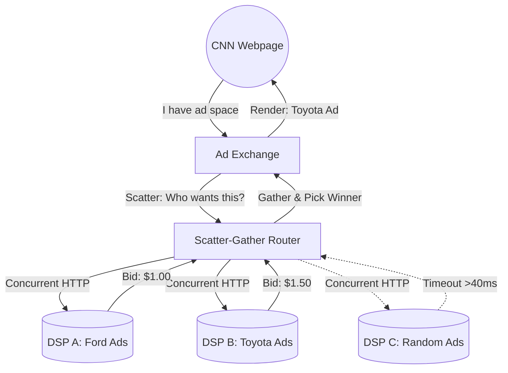

# 🎯 Design an AdTech Real-Time Bidding (RTB) System

**Core Domains:** Extreme Latency Constraints, Aggregator Patterns, Big Data.  
**Primary Concepts Demonstrated:** Strict $<100\text{ms}$ SLAs, Scatter-Gather Pattern, High-Throughput Bid Processing.

---

## 1. Scope & Requirements
When a user opens CNN.com, an empty banner ad appears for a fraction of a second. In that split second, CNN contacts an Ad Exchange, which contacts 100 different advertising companies (DSP - Demand Side Platforms) globally, asking: *"Who wants to show an ad to a 35-year-old male from Chicago?"* The 100 companies calculate their physical bids internally (`$1.05`), send them back, the Exchange picks the winner, and the CNN website renders the ad. This entire process must complete before the webpage finishes loading.

*   **Traffic Focus:** Immense QPS, Strict Latency.
*   **Throughput:** 1 Million Ad Requests from users per second.
*   **Latency constraint:** The entire bidding war spanning multiple external servers **must** complete in $<100\text{ms}$. If an advertiser's server takes $101\text{ms}$, their bid is completely ignored.

---

## 2. API Design & The Latency Budget
Out of the $100\text{ms}$ total round-trip budget:
*   $20\text{ms}$ is consumed by mobile network latency from CNN to the Ad Exchange.
*   $10\text{ms}$ is consumed by the Exchange parsing the user profile.
*   $10\text{ms}$ is consumed by network latency from the Exchange to the 100 Advertisers.
*   **The Advertiser Backend (DSP)** only has $\approx 40\text{ms}$ to process the user data, run an ML model to determine if the user is likely to buy a car, calculate a dollar value, and return the HTTP response.

---

## 3. High-Level Design (HLD): The Scatter-Gather Pattern

To maintain strict $<100\text{ms}$ SLAs when communicating with 100 external third-party servers, you cannot use a sequential `for loop`. You must execute requests heavily in parallel using the **Scatter-Gather** pattern.

*   **How it works:** The Aggregator spins up 100 asynchronous threads to hit the 100 DSP APIs simultaneously. It sets a strict `Timeout(40ms)`. When the timer hits $40\text{ms}$, the Aggregator immediately kills any hanging threads, tallies the received bids, picks the highest, and returns it.

---

## 4. Addressing Severe AdTech Limitations

### A. The DSP Pacing Problem (Budget Exhaustion)
If Toyota sets a budget of $\$10,000$ for the entire day, but at 9:00 AM there is a massive spike in news traffic, the DSP might win 10,000 bids at $\$1$ each in the first 5 minutes. Toyota's budget is drained securely, but Toyota is furious because they wanted their ads spread evenly throughout the 24-hour day.
*   **Limitation:** A purely reactive system will exhaust funds during traffic spikes.
*   **Solution: The Pacing Algorithm.** The DSP does not bid on every valid request. It calculates a throttling coefficient based on the time of day and remaining budget. If it's early in the day and the budget is depleting too fast, it probabilistically ignores $80\%$ of perfectly valid ad requests to stretch the budget until midnight.

### B. Billions of Discarded Events (Log Tsunami)
Tracking clicks and impressions is how advertisers are billed. But the system processes 1 Million bids a second, generating Terabytes of log data every hour. Writing this to a standard SQL database is physically impossible.
*   **Limitation:** Extreme Write Amplification for logging.
*   **Solution: In-Memory Aggregation -> Kafka -> ClickHouse/Druid.**
    Instead of writing `Bid=1.50` row-by-row to a database, the API gateway aggregates counters in local RAM for 5 seconds (`Total Toyota Bites: 5,000`). It dumps this aggregated stat to **Kafka**, which pipes it heavily to an OLAP (Online Analytical Processing) columnar database like Apache Druid or ClickHouse, designed specifically to ingest 10 Million rows/sec and query them via SQL instantly for billing dashboards.

### C. The Anti-Fraud ML Pipeline
Competitors use bots to click on ads (Click-Fraud), costing the advertiser money maliciously.
*   **Limitation:** Operating complex ML models to detect fraud within the $40\text{ms}$ critical path is impossible.
*   **Solution:** **Lambda Architecture (Batch + Stream).** Fraud detection happens post-bid. Apache Flink monitors the Kafka click-stream locally. If it detects 100 clicks from the same IP address in 10 seconds, it instantly flags the IP as fraudulent and writes it to a Redis Blacklist. Future bids check the $O(1)$ fast Redis blacklist during the $40\text{ms}$ window to ignore the bot traffic.

---

## 5. Frequently Asked Hard Interview Questions
**Q: Data Privacy (GDPR/CCPA). How do you universally "delete" a user's tracking history if that data is spread across Kafka, Druid, and Backups?**
*Answer:* Hard deleting rows from an append-only time-series OLAP system (Druid) is wildly inefficient. The industry uses **Crypto-Shredding**. The user's tracking ID is encrypted with a specific cryptographic key uniquely assigned to them, housed in a highly secure Key Management Service (KMS). To completely "delete" the user across petabytes of architecture, we don't delete the data streams. We delete their *decryption key* from the single KMS matrix. Instantly, all their data across every database becomes computationally unreadable random noise, fully satisfying GDPR.

**Q: How do you track a user accurately if they switch from their Laptop browser to their Mobile App (Cross-Device Graph)?**
*Answer:* **Deterministic & Probabilistic Matching.** Deterministic logic links them permanently if they "Login" to a service on both devices (Google/Facebook IDs). Where login fails, a distributed Graph Database analyzes probabilistic edges: "Device A and Device B connect to the exact same home IP WiFi address every evening at 6 PM, and both frequently visit similar obscure web pages." The graph scores the probability and dynamically merges their advertising profile into an overarching `Household_ID`.
