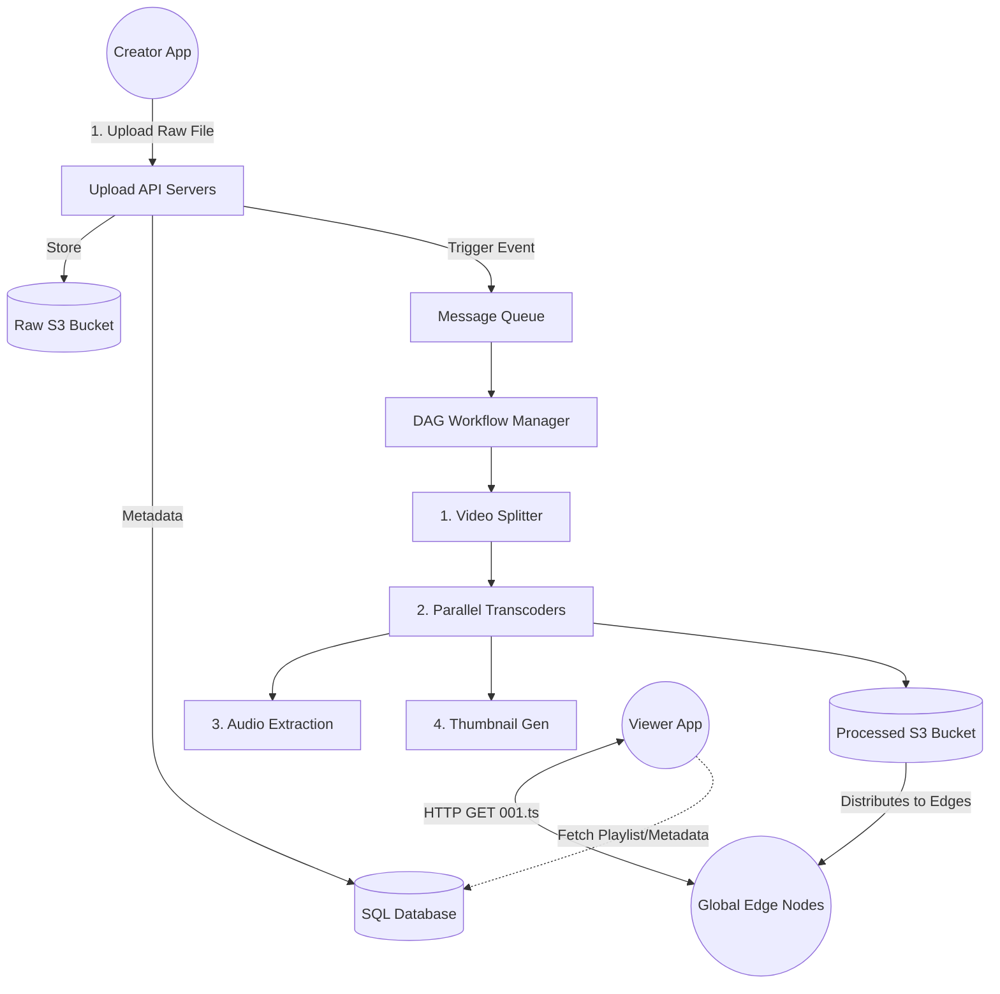

# Design 6: Video Streaming (YouTube / Netflix)

Building a video streaming platform is one of the most resource-intensive challenges in system design. It requires massive raw storage, intense CPU compute for video transcoding, and incredibly optimized global delivery networks (CDNs).

---

## 1. Clarification & Requirements

### Functional Requirements
1.  **Upload:** Users can upload massive video files (up to 128GB).
2.  **Streaming:** Users can play videos smoothly without buffering.
3.  **Adaptive Bitrate:** The video quality automatically adjusts based on the viewer's internet speed (e.g., 1080p downgrades to 480p on a bad 3G signal).

### Non-Functional Requirements
1.  **High Availability:** The streaming service must never go down.
2.  **Low Latency (Streaming):** Time-to-first-byte (Play button click to video start) must be minimal.
3.  **Throughput (Processing):** Video uploads must be processed and made available securely within minutes, not days.

---

## 2. Back-of-the-Envelope Estimation

Assume **1 Billion DAU (Daily Active Users)**.
*   *Write Ratio:* 1 video uploaded per 1,000 DAU = 1 Million uploads per day.
*   *Read Ratio:* 5 videos watched per DAU = 5 Billion streams per day.

### Storage & Bandwidth
*   Average raw video size: 50MB.
*   **Daily Storage (Original):** `1M * 50MB = 50 Terabytes (TB) / day.`
*   **Transcoding Multiplication:** We don't just store the original. We must save a 4K version, 1080p, 720p, 480p, and 360p version across multiple formats (MP4, WebM, HLS). One 50MB upload turns into 200MB of stored data.
*   **True Daily Storage:** `200TB / day.` (Over 70 PB a year).
*   **Bandwidth Egress:** Streaming 5 Billion videos (average 30MB compressed) per day consumes **1.7 Terabytes per second (TB/s)** of continuous bandwidth. *No single data center can handle this.*

---

## 3. The Core Architecture: Separating Upload from Streaming

We must completely decouple the `Upload Pipeline` from the `Streaming Pipeline`.

### The Upload Pipeline (The DAG)
Video processing is incredibly CPU intensive. A 10-minute 4K video might take a single computer 3 hours to transcode. We must paralyze this.

We use a **Directed Acyclic Graph (DAG) Workflow Engine** (e.g., Apache Airflow, Netflix Conductor).
1.  **Upload:** User uploads `raw_video.mov` to an S3 Bucket.
2.  **Trigger:** An event is fired to a Message Queue (Kafka/RabbitMQ).
3.  **The DAG Master:** The Workflow Engine reads the event and breaks the massive video into 10-second "Chunks".
4.  **Parallel Workers:** It spins up 1,000 Docker containers.
    *   *Worker Group A:* Takes Chunk 1, transcodes to 1080p, 720p, 360p.
    *   *Worker Group B:* Takes Chunk 1, extracts audio track.
    *   *Worker Group C:* Takes Chunk 1, generates thumbnails.
5.  **Assembly & Storage:** When all thousands of tasks finish, the files are securely stored in the Processed S3 Bucket as DASH/HLS segments.

### The Streaming Pipeline (The CDN)
If 100 Million people try to stream the Superbowl from the Processed S3 bucket in Virginia, the internet backbone will collapse. We must use a **Content Delivery Network (CDN)**.

1.  *Push/Pull:* Once the video is processed, it is either proactively pushed to edge servers worldwide, or pulled by those servers on the first cache miss.
2.  *HLS/DASH Streaming:* We do not send a 2GB MP4 file to the user. We send a tiny text file (a Playlist) that tells the browser where to download 5-second chunks (segment `001.ts`, `002.ts`). The browser downloads these chunks sequentially.
3.  *Adaptive Bitrate (ABR):* If the browser detects the 5-second chunk took 8 seconds to download, it realizes the internet is slow. For segment `003.ts`, it asks the CDN for the 480p version instead of the 1080p version, preventing the video from freezing.

---

## 4. High-Level Design (HLD)

---

## 5. Metadata Database Schema (SQL vs NoSQL)

Do we use SQL or NoSQL for YouTube's metadata (Titles, Descriptions, Likes, View Counts)?

*   **Choice:** We need a hybrid approach.
*   **Video Details (SQL):** Video title, channel owner, creation date, privacy settings. These are highly structured, relational data points. (PostgreSQL).
*   **View Counts (Redis + Cassandra):** 5 Billion streams a day means 5 Billion `UPDATE video SET views = views + 1`. This will instantly crash a SQL database.
    *   *Solution:* We buffer view counts in **Redis** (atomic increments `INCR`). Every 5 minutes, a background cron job reads the totals from Redis and executes one massive batch `UPDATE` into a NoSQL Wide-Column DB like **Cassandra**.

---

## 6. Edge Cases: Security and DRM
*   **Pre-Signed URLs:** We don't want users uploading directly to our API servers, because it ties up the server's TCP connection for 30 minutes while a 5GB file uploads.
    *   *Solution:* The client asks the API for a "Pre-Signed S3 URL". The API gives the client a temporary, 1-hour cryptographic token. The client uploads the 5GB file *directly* to Amazon S3, completely bypassing our backend servers and saving us massive bandwidth costs.
*   **Copyright/DRM:** During the DAG Transcoding phase, Netflix incorporates Widevine/FairPlay encryption directly into the 5-second video chunks so they cannot be pirated or downloaded.
