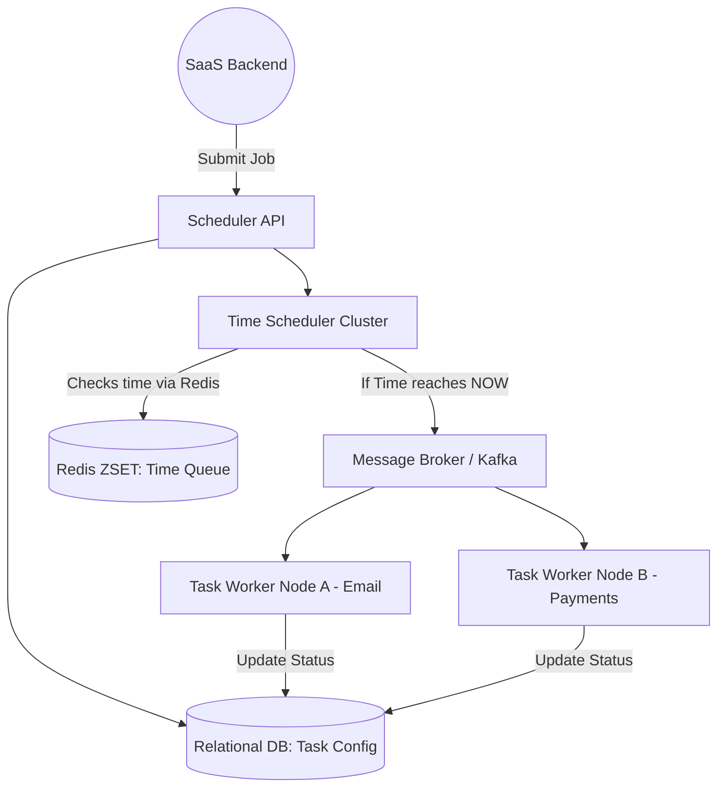

# ⏳ Design a Distributed Task Scheduler

**Core Domains:** Cron Jobs, Event Scheduling, Message Queues, Distributed Locking.  
**Primary Concepts Demonstrated:** Delay Queues (RabbitMQ/Kafka), Time-Wheel Algorithms, Quartz Scheduler, High Availability.

---

## 1. Scope & Requirements
System Design interviews often shift away from entire products (like Netflix) to core infrastructure pieces. A classic question is designing the system that runs background tasks: "Send a reminder email 24 hours from now", "Process millions of video transcodes automatically", or "Run payroll at exactly midnight on the 30th".

*   **Traffic Focus:** Spiky writes, spiky compute loads (e.g., Midnight bursts).
*   **Scale:** Millions of registered tasks with microsecond precision.
*   **Availability:** 99.999% Guaranteed execution. A task must **never** be ignored or run twice (Exactly-Once Semantics).

---

## 2. API Design & The "Execution Time" Problem

`submitTask(task_payload, start_time_epoch, retry_policy)`
`cancelTask(task_id)`

### The Database Bottleneck
The naive approach is storing every task in a PostgreSQL table with a `run_at` timestamp. A centralized server runs a `WHILE TRUE` loop:
`SELECT * FROM tasks WHERE run_at <= NOW() AND status = 'PENDING';`
*   **Why this fails at scale:** If you have 10 Million tasks scheduled for exactly midnight, a single database cannot retrieve, lock, process, and update 10 Million rows at 12:00:00 without severely crashing from IOPS exhaustion.

---

## 3. High-Level Design (HLD): The Broker & Worker Model

To achieve massive scale, the system is decoupled into **Schedulers** (who keep time) and **Workers** (who do the heavy lifting).

---

## 4. The Algorithm: How to Keep Time Efficiently

You cannot "poll" a MySQL database 100 times a second to see if it's 3:00 PM.

### Approach A: The Redis Sorted Set (ZSET)
A highly effective industry pattern.
1.  When a task is submitted, the API writes a short ID into a Redis ZSET. The "Score" of the item is the Unix epoch timestamp (e.g., `1710500000`).
2.  The Schedulers continuously run a lightweight Redis command: `ZRANGEBYSCORE tasks -inf NOW`.
3.  Redis returns all items where the timestamp has passed. Since the ZSET is pre-sorted in RAM, getting the "due" tasks is virtually instantaneous ($O(\log N)$).
4.  The Schedulers dump those task IDs into a Kafka queue for workers to consume.

### Approach B: The Hashed Time Wheel (Used in Kafka/Netty)
If you require microsecond precision for millions of tasks, Redis ZSET inserts become a bottleneck.
A **Time Wheel** is an algorithmic data structure. Imagine a physical clock with 60 slots (seconds). 
*   If it's currently second `5`, and you schedule a task for second `15`, you place the task payload in slot 15.
*   The "Tick" pointer moves forward 1 slot every second. When the pointer reaches slot 15, it executes the payload in $O(1)$ time. 
*   For tasks hours away, concentric wheels are used (Seconds $\to$ Minutes $\to$ Hours gears).

---

## 5. Overcoming Scale Limitations

### A. The "Double Execution" Concurrency Threat
What if *Scheduler Node A* and *Scheduler Node B* both pull the same task from Redis at the exact same millisecond? The system might charge Alice's credit card twice for her subscription.
*   **Limitation:** Distributed systems inherently race each other.
*   **Solution 1 (Pessimistic DB Locks):** When the Scheduler pulls the ID, it attempts an SQL lock: `UPDATE tasks SET status='RUNNING' WHERE id=5 AND status='PENDING'`. Only one DB row update will succeed; the other node will get an error and abandon the duplicate task.
*   **Solution 2 (Idempotent Consumers):** Ensure the final Worker API is fully idempotent. If Kafka delivers the payment task twice, the Payment Gateway API rejects the second one because it possesses the same unique `Idempotency-Key` (See Stripe Gateway doc).

### B. Worker Machine Failure
A worker pulls an email task from the queue, crashes halfway through rendering the email, and never sends it. The task sits at `STATUS: RUNNING` forever.
*   **Mitigation:** The **Dead Letter Queue (DLQ)** and **Redelivery**.
    *   The Message Broker (RabbitMQ/SQS) requires the worker to send an explicitly `ACK` (Acknowledgement) packet when the job is functionally complete.
    *   If the worker network socket dies, or a 5-minute timeout occurs without an `ACK`, the Message Broker assumes the worker died. It automatically pushes the task back to the front of the queue to be picked up by a healthy worker.

### C. Poison Pill Tasks
If a task payload is corrupted (e.g., invalid JSON), it will crash Worker A. The MQ will redeliver it to Worker B, crashing B, and so on until the entire worker fleet is destroyed.
*   **Mitigation:** **Max Retries Threshold.** After 3 successive failures, the MQ routes the task strictly to the Dead Letter Queue for human engineering inspection, preventing infinite crash loops.

---

## 6. Frequently Asked Hard Interview Questions
**Q: What happens if a job takes 5 hours to execute, and during that 5 hours, the server is restarted during routine maintenance? Does the job fail completely?**
*Answer:* **Heartbeats and Checkpointing.** A healthy worker does not stay entirely silent for 5 hours. It sends an HTTP Ping (Heartbeat) to the MQ every minute. If the server dies, the heartbeats stop, and the MQ instantly releases the task to another node. To prevent starting the 5-hour task from `Time=0`, the application logic must perform **Checkpoints**. It constantly writes its processing state (e.g., "Processed row 50,000") to a shared database. The new replacement worker queries the Checkpoint DB and resumes directly from row 50,001.

**Q: Handling massive timezone and Daylight Saving Time (DST) shifts. A job is scheduled for 2:30 AM, but DST causes the clocks to jump from 2:00 AM straight to 3:00 AM. Does the job disappear?**
*Answer:* The underlying physical database and Redis scheduling ZSETs **strictly operate on UTC Unix Epoch Time**, which represents absolute physical seconds irrespective of earth bound rules. Timezones and DST are strictly a User Interface (Frontend) presentation layer logic problem. When the user sets "2:30 AM EST", the API immediately converts it to universal UTC Epoch ticks before ingestion. The Time Wheel executes perfectly.
