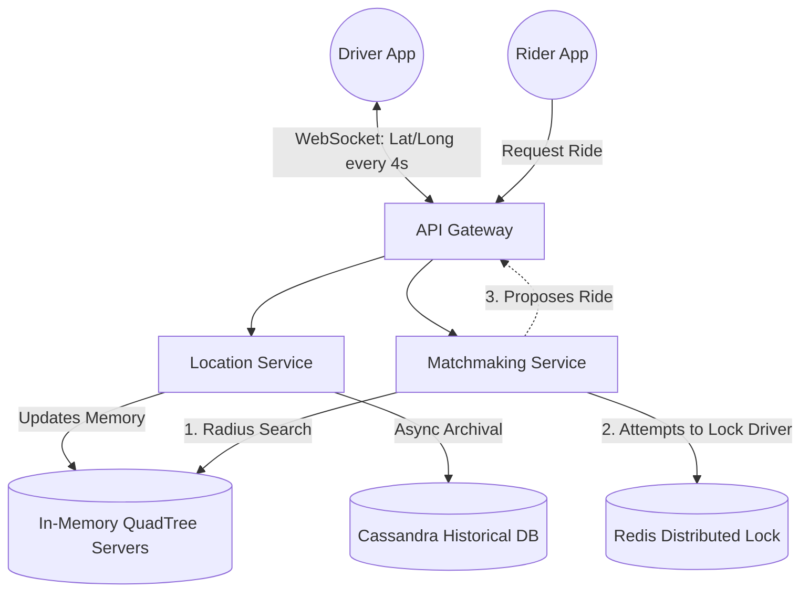
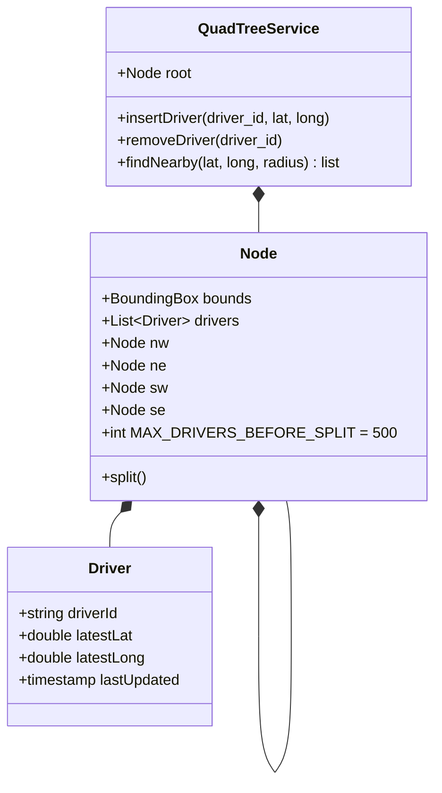

# Design 3: Ride-Hailing Service (Uber / Lyft)

Designing a system to match riders with drivers involves solving two complex problems simultaneously:
1.  **Massive Write Throughput:** Tracking the real-time GPS coordinates of millions of drivers every 4 seconds.
2.  **Geospatial Search:** Finding all drivers within a 2-mile radius of a rider in less than a second.

This architecture requires ignoring standard SQL practices and moving entirely to memory-based spatial indexing.

---

## 1. Clarification & Requirements

### Functional Requirements
1.  **Location Tracking:** Drivers stream their GPS coordinates to the server constantly.
2.  **Ride Request:** A rider requests a ride; the system finds nearby drivers.
3.  **Matching:** The system proposes the ride to a driver. If accepted, the ride begins.

### Non-Functional Requirements
1.  **Low Latency Search:** The spatial search must happen instantaneously.
2.  **High Concurrency (No Double Booking):** If two riders request a ride simultaneously, they cannot match with the exact same driver.
3.  **High Availability:** The system cannot drop matches due to server failure.

---

## 2. The Core Problem: Geospatial Search
How do we find drivers within a 3-mile radius?

*   **The SQL Nightmare:** A naive approach stores driver locations in PostgreSQL: `(driver_id, lat, long)`. To find nearby drivers, the query is:
    ```sql
    SELECT * FROM drivers 
    WHERE lat BETWEEN (rider_lat - radius) AND (rider_lat + radius)
    AND long BETWEEN (rider_long - radius) AND (rider_long + radius);
    ```
    *Why this fails:* A B-Tree index cannot index two independent variables (lat and long) simultaneously for a 2D range search efficiently without a massive full-table scan. Plus, updating the index every 4 seconds for 1 million drivers will melt the SSD.

### The Solution: Grid Systems and QuadTrees

We need a way to reduce 2D coordinates into a 1D string that CAN be indexed perfectly.

#### Approach 1: Geohashing (Used by Google S2 and Uber H3)
The Earth is divided into a massive grid of squares (or hexagons, in H3's case).
*   Each square is assigned a unique String ID (e.g., `gbsuv`).
*   As you zoom in, the string gets longer (`gbsuv7`). As you zoom out, it gets shorter (`gbs`).
*   **The Magic:** Finding nearby drivers is no longer complex math. It's a simple exact string match `WHERE grid_id LIKE 'gbs%'`.
*   *Implementation:* We can store this directly in **Redis** as a simple Key-Value pair `redis.get(grid_id) -> List of Drivers`.

#### Approach 2: The Canonical QuadTree
A QuadTree is a specialized tree data structure used specifically to partition a two-dimensional space.
*   The root node represents the entire globe.
*   It splits into 4 child nodes (NW, NE, SW, SE).
*   If a node has more than 500 drivers inside it, it splits again into 4 smaller nodes.
*   **The Magic:** When a rider searches for a ride, the system traverses the tree down to the specific leaf node covering the rider's area and instantly retrieves the 500 closest drivers.
*   *Implementation:* A QuadTree must be kept entirely in RAM (Memory) because updating the tree structure constantly on a hard drive is too slow.

---

## 3. High-Level Design (HLD)

We separate the system into two distinct flows: **The Driver Stream** (Write-Heavy) and **The Matchmaker** (Read/Lock-Heavy).



---

## 4. Deep Dive: Handling Concurrency and Failures

### A. The "Double Booking" Avoidance (Distributed Locks)
What happens if two riders in identical locations request a ride, and the QuadTree returns Driver "John" to both of them simultaneously?

*   *Scenario:* Both matchmaking servers attempt to assign John. We cannot let both succeed.
*   *Solution:* We introduce **Redis `SETNX` (Set if Not Exists)**.
    1.  MatchServer A tries to lock John: `SETNX driver_lock:john_123 1 EX 10` (Locks John for 10 seconds). It succeeds.
    2.  MatchServer B tries to lock John: `SETNX driver_lock:john_123 1 EX 10`. It fails because the key already exists. MatchServer B automatically moves on to the second-closest driver.
    3.  If John rejects the ride, Server A deletes the lock. If he accepts, the ride begins and John is removed from the QuadTree entirely.

### B. QuadTree Server Failure (The SPOF)
If the server holding the RAM-based QuadTree crashes, we instantly lose the location of every driver in that quadrant.
*   *Solution:* **Replication and Heartbeats**.
    1.  We maintain a Primary and a Replica QuadTree server.
    2.  The Driver streams locations to to the Location Service, which explicitly writes to BOTH the Primary and the Replica simultaneously.
    3.  If the Primary crashes, Zookeeper detects the missing heartbeat and promotes the Replica to Primary in milliseconds. Zero data loss.

### C. Why WebSockets?
Why don't we just use HTTP POST requests every 4 seconds?
*   *Overhead:* HTTP requires a massive TCP handshake, header parsing, and SSL negotiation for every single request. Multiplying this by 1 million drivers every 4s destroys the network bandwidth (mostly with useless headers).
*   *Solution:* **WebSockets**. A permanent, bi-directional, stateful TCP pipe. The driver opens the connection once. Sending a location is just a tiny 50-byte payload over the open pipe. Crucially, the Server can proactively *push* a ride request back down the pipe instantly without waiting for the client to poll.

---

## 5. Low-Level Design (QuadTree Data Structure)

In an interview, you may be asked to sketch the Object-Oriented design of the QuadTree node (LLD).


