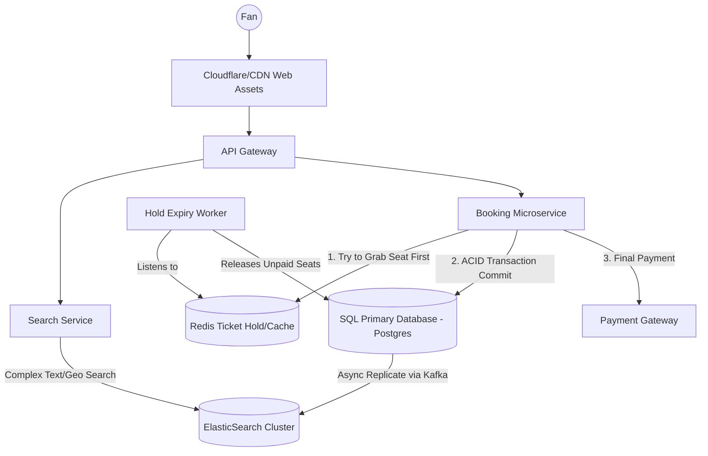

# Design 4: Ticketmaster (Highly Concurrent Booking)

Designing Ticketmaster is the ultimate test of a database engineer. Unlike social media, where eventual consistency is fine, Ticketmaster requires **absolute, unforgiving consistency**. If two people buy the exact same seat at a Taylor Swift concert, your company will be on the front page of the news.

---

## 1. Clarification & Requirements

### Functional Requirements
1.  **Search:** Users can search for concerts, venues, and view available seats.
2.  **Booking Engine:** Users can reserve seats, locking them for 10 minutes while they enter payment details.
3.  **Checkout:** Finalizing the transaction transfers ownership of the seat.

### Non-Functional Requirements
1.  **No Double Booking:** Strict ACID consistency. A seat must never be sold twice.
2.  **High Concurrency (The Thundering Herd):** A popular concert releases 50,000 tickets at exactly 10:00 AM. 10 Million fans hit the "Buy" button at 10:00:01 AM. If the system fails to handle this spike, the platform dies.
3.  **Fairness:** If John clicks "Reserve" 1 millisecond before Alice, John gets the seat.

---

## 2. Infrastructure Math & Scale
Ticketmaster is a highly Read-Heavy system (until a mega-event goes on sale).
*   **Search Traffic:** `Millions of reads/sec` inspecting available seats.
*   **Checkout Traffic:** `Thousands of writes/sec` during an event launch.

---

## 3. The Core Problem: The Double Booking Concurrency Dilemma

**Scenario:** Seat A1 is available. John and Alice both see it as available on their screens. They both click "Reserve" at the exact same millisecond. 
Both requests hit two different web servers.

### The Naive 3-Step Process (Why it fails):
1.  Server A (John): `SELECT status FROM Seats WHERE id = 'A1'` -> Returns 'Available'.
2.  Server B (Alice): `SELECT status FROM Seats WHERE id = 'A1'` -> Returns 'Available'.
3.  Server A (John): `UPDATE Seats SET status = 'Reserved', user = 'John' WHERE id = 'A1'` -> Success.
4.  Server B (Alice): `UPDATE Seats SET status = 'Reserved', user = 'Alice' WHERE id = 'A1'` -> Success.
*Result: Alice just overwrote John's ticket. Double Booking.*

### Solution 1: Pessimistic Locking (SQL For Update)
We must lock the row at the database level the moment the first `SELECT` statement hits it.
```sql
BEGIN TRAN;
-- The database literally halts any other query from touching this row
SELECT * FROM Seats WHERE id = 'A1' FOR UPDATE; 

UPDATE Seats SET status = 'Reserved' WHERE id = 'A1';
COMMIT;
```
*   *Pros:* 100% guarantees no double booking.
*   *Cons:* Incredibly slow during a Thundering Herd. If 10,000 people try to book A1, the database queues up 10,000 queries sequentially. The 10,000th person's browser will spin for minutes before returning "Taken".

### Solution 2: Optimistic Locking (Row Versioning)
Instead of locking the row instantly, we allow everyone to read it. But we add a `version_number` column.
```sql
-- Both read Version 1
SELECT status, version FROM Seats WHERE id = 'A1'; 

-- John tries to update, expecting version 1. It works, and bumps version to 2.
UPDATE Seats SET status = 'Reserved', version = 2 WHERE id = 'A1' AND version = 1;

-- Alice tries to update immediately after, expecting version 1. 
-- It FAILS, because the database sees the version is now 2.
UPDATE Seats SET status = 'Reserved', version = 2 WHERE id = 'A1' AND version = 1;
```
*   *Pros:* Extremely fast reads. No database blocking/locking overhead.
*   *Cons:* 9,999 people get a harsh "Booking Failed" error on the frontend because their `UPDATE` failed the version check. We must handle this gracefully in the UI.

### Solution 3: The Redis First-Pass Strategy (The Industry Standard)
Hitting a SQL database 10 million times in a second will crash it, regardless of locking strategies. We must intercept the traffic in memory.
1.  On Startup: A worker script pushes all 50,000 seats into Redis as standalone keys: `SET seat_A1:available "true"`.
2.  When John tries to book: We use Redis's atomic operations. `EVAL` a Lua script that checks if `seat_A1` exists, and if so, deletes it and returns "Success". Because Redis is single-threaded, it perfectly sequences the 10,000 concurrent requests.
3.  Only John's request (which succeeded in Redis) is allowed to proceed to the SQL Database to execute the slow, transactional `UPDATE`. The other 9,999 requests are instantly rejected from RAM before touching the DB.

---

## 4. The 10-Minute Hold Problem

When John successfully reserves a seat, he gets 10 minutes to type in his credit card. If he closes his browser, what happens to the seat?

*   *Database Polling:* (Bad). Writing a cron job `SELECT * FROM reservations WHERE timestamp < NOW() - 10 MIN` and looping this every 10 seconds is incredibly inefficient.
*   *Redis Key Expiry:* (Good). When John reserves the ticket, we create a Redis key with a TTL (Time-to-Live): `SET reservation:A1 "John" EX 600`.
*   *The Magic:* We subscribe to a **Redis Keyspace Notification**. When `reservation:A1` mathematically expires at 10 minutes, Redis automatically fires an Event. A microservice catches this event, updates the SQL database to `Available`, and pushes a WebSocket packet to the frontend letting users know A1 is free again.

---

## 5. High-Level Design (HLD)



---

## 6. Low-Level Database Schema (SQL is Mandatory)

**Table: Venue**
*   `venue_id` (PK)
*   `name`, `location`

**Table: Event**
*   `event_id` (PK)
*   `venue_id` (FK)
*   `date`, `artist_name`

**Table: Seat_Inventory**
*   `seat_id` (PK)
*   `event_id` (FK - Indexed)
*   `status` (Enum: `AVAILABLE`, `HELD`, `BOOKED`)
*   `version` (Optimistic Locking Integer)
*   `reserved_by_user_id`

*Why SQL here?* We absolutely need ACID guarantees. If Stripe charges heavily, we must guarantee the `Seat_Inventory` updates, or we rollback the entire transaction. A NoSQL wide-column store cannot provide multi-table transactional rollbacks easily.
