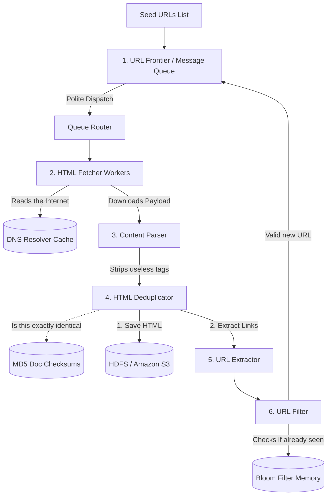

# Design 5: Web Crawler (Google Search / Archive.org)

A web crawler is a system designed to systematically browse the World Wide Web to download and index content. It is fundamentally a mathematical graph traversal problem (specifically, Breadth-First Search) executed on a massive, distributed scale.

---

## 1. Clarification & Requirements

### Functional Requirements
1.  **Seed Provisioning:** Start with a list of "seed" URLs (e.g., `nytimes.com`, `wikipedia.org`).
2.  **HTML Extraction:** Fetch the HTML of those URLs.
3.  **Link Parsing:** Extract all `<a>` tags (hyperlinks) from the fetched HTML.
4.  **Storage:** Save the fetched HTML payload to disk for future indexing.
5.  **Recursion:** Add the newly discovered links to the "to-crawl" queue and repeat the process endlessly.

### Non-Functional Requirements & The Crawler's Golden Rules
1.  **Politeness (Do Not DDoS the Internet):** A web crawler must never send 1,000 requests per second to a single server (like `small-blog.com`), or it will crash their infrastructure. We must enforce a delay (e.g., 5 seconds) between requests to the same hostname.
2.  **Scalability:** The web contains roughly 50 to 100 billion pages. We must crawl it using thousands of workers in parallel.
3.  **Extensibility:** We should be able to easily plug in new parsers (e.g., Image extraction, PDF parsing).
4.  **Robustness (Avoiding Spider Traps):** The internet is malicious. Some servers dynamically generate endless loops of URLs (e.g., `/page/1 -> /page/2 -> ... -> /page/infinity`) just to trap crawlers. We must detect and break these loops.

---

## 2. Back-of-the-Envelope Estimation

Assume we want to crawl **1 Billion web pages per month**.

*   **QPS:** `1,000,000,000 / (30 days * 24h * 3600s) = ~400 pages / second.`
*   **Peak QPS:** Assume `800 pages / second` for capacity planning.
*   **Storage (The HTML):** Assume the average HTML page is 500 KB.
    *   `1 Billion pages * 500 KB = 500 Terabytes (TB) per month.`
    *   If we keep 5 years of history, we need **30 Petabytes (PB)** of storage.

---

## 3. The Core Challenge: The URL Frontier

The central nervous system of a Web Crawler is the queue holding all the URLs waiting to be downloaded. This is called the **URL Frontier**.

### Problem A: Politeness
We have a traditional FIFO queue. The first 10,000 URLs in the queue happen to point to `wikipedia.org`. If 1,000 crawler workers pull from this queue simultaneously, they will slam Wikipedia with 1,000 instantaneous requests.

*   **The Fix:** Instead of one massive queue, the URL Frontier manages thousands of sub-queues.
    1.  Each sub-queue is strictly bound to a single Hostname (e.g., Queue 84 only holds `wikipedia.org` links).
    2.  A Worker Thread is assigned to Queue 84. It pulls a URL, downloads it, and then explicitly sleeps for 5 seconds before pulling the next URL from Queue 84. This guarantees we treat servers politely.

### Problem B: Circular References & Duplicates
How do we know if we've already crawled `https://www.apple.com`? If we don't know, we will crawl the same pages forever in an infinite loop.

We must maintain a `seen_urls` cache. But we are crawling 10 Billion URLs. Storing 10 Billion strings in a Redis cache takes terabytes of RAM. Checking a SQL database 800 times a second.

*   **The Fix:** We must use a **Bloom Filter**.
    *   A Bloom Filter is a probabilistic bit-array. It can store 10 Billion "Existence Checks" using vastly less memory (e.g., 50-100 GB RAM instead of 5 TB).
    *   When a new URL is found, we query the Bloom Filter: "Have I seen this?". If it returns YES, we discard the URL. If it returns NO, we add the URL to the Frontier and update the Bloom Filter. (Remember: Bloom filters have a slight false-positive rate, meaning we might accidentally skip a page, but they never have false-negatives, meaning we will never get trapped in an infinite loop).

---

## 4. High-Level Design (HLD)

Let's trace the lifecycle of a single HTTP request through the Crawler architecture.

---

## 5. Deep Dive: Component Breakdown

### 1. HTML Fetcher & The DNS Bottleneck
Fetching HTML requires a DNS lookup to convert `google.com` into an IP Address. DNS lookups take 10ms - 200ms. If we do this 800 times a second, DNS becomes a massive bottleneck.
*   *Solution:* We build a custom local DNS Cache on our crawler machines to avoid hitting Root DNS servers constantly.

### 2. URL Filter (Blacklisting & Scrubbing)
Before passing a URL to the Bloom filter, we clean it up.
1.  **Normalization:** We convert `http://www.EXAmple.com/` to `http://example.com/`. We remove URL fragments like `#section2` (because they point to the exact same HTML page).
2.  **Blacklisting:** We reject any URL ending in `.exe`, `.pdf`, `.mp4`, or matching known malicious domains using a fast Trie data structure.

### 3. Content Deduplication (MD5 Checksums)
What if two totally different URLs (e.g., `amazon.com/product/abc` and `amazon.com/sale/abc`) point to the exact same HTML content? We don't want to store identical 500KB blobs twice.
*   *Solution:* Before saving the HTML, we compute its MD5 hash. We check a Redis cache `hash_exists(md5)`. If it exists, we discard the duplicate HTML blob. If it doesn't, we save it.

### 4. Storage (Big Data)
We have 30 Petabytes of data. We cannot use SQL or standard Cassandra logic. We need a Distributed File System like **Hadoop HDFS** or massive blob storage like **Amazon S3**.
*   *Efficiency:* We don't write 1 Billion tiny 500KB files to S3. Writing small files creates massive metadata overhead. We bundle 10,000 HTML pages together, compress them, and write them to disk as a single large 5 GB file.
