# GSD Pro: The Ultimate System Design Masterclass

Welcome to **GSD Pro**, the definitive, single-page system design masterclass. This course is structured for senior software engineers, technical leads, and architects. It covers foundational scaling principles and dissects real-world architectures with Low-Level (LLD) and High-Level Design (HLD) diagrammatic breakdowns.

---

## 🏗️ Module 1: The Foundations of Scalability

To design systems at a global scale, you must intimately understand the foundational building blocks.

### 1.1 Key Characteristics of Distributed Systems
**Concept:** A system's quality is judged by its non-functional requirements.
*   **Scalability:** Vertical (scaling up) vs. Horizontal (scaling out).
*   **Availability:** Measured in "nines" (e.g., 99.999% uptime).
*   **Reliability:** The probability that a system will perform its intended function without failure.
*   **Latency vs. Throughput:** Latency is the time to perform an action; throughput is the number of actions per unit of time.

### 1.2 Load Balancing (LB)
**Concept:** Distributing incoming network traffic across a group of backend servers.
*   **Pros:** Prevents Single Point of Failure (SPOF), seamless scaling, SSL termination.
*   **Cons:** Can become a bottleneck itself; adds a layer of complexity; stateful loads are notoriously hard to balance.
*   **Real-world Example:** NGINX, HAProxy, AWS ALB/NLB.
*   **Algorithms:** Round Robin, Least Connections, IP Hash.

### 1.3 Caching
**Concept:** A temporary storage layer that serves data faster than querying a persistent datastore.
*   **Pros:** Massive read latency reduction, protects databases from thundering herds.
*   **Cons:** Cache invalidation is one of the hardest problems in CS; data staleness; risk of cache stampede on expiry.
*   **Real-world Example:** Redis, Memcached, Cloudflare (CDN).
*   **Eviction Policies:** LRU (Least Recently Used), LFU (Least Frequently Used).

### 1.4 Data Partitioning (Sharding)
**Concept:** Splitting a large logical database into smaller, manageable physical databases (shards).
*   **Pros:** Infinite horizontal scalability; improves read/write throughput dramatically.
*   **Cons:** Complex joins (`JOIN`) across shards are virtually impossible; lack of distributed transactions; schema evolution is painful; hotspotting (if the shard key is poor).
*   **Real-world Example:** MongoDB sharded clusters, Vitess (for MySQL).

### 1.5 Indexes
**Concept:** A data structure that improves the speed of data retrieval operations.
*   **Pros:** O(log N) or O(1) lookup speeds; dramatically speeds up read operations.
*   **Cons:** Slows down `INSERT`, `UPDATE`, and `DELETE` operations (because the index must be updated); takes up additional disk space.
*   **Real-world Example:** B-Trees in PostgreSQL, LSM Trees in Cassandra.

### 1.6 Proxies (Forward & Reverse)
**Concept:** An intermediary server separating end-users from the websites they browse.
*   **Forward Proxy:** Sits in front of a group of client machines (e.g., corporate network filter).
*   **Reverse Proxy:** Sits in front of web servers and forwards client requests (e.g., Nginx).
*   **Pros:** Caching, security (hides backend), compression, load balancing.

### 1.7 Message Queues
**Concept:** Asynchronous communication protocols allowing producers to send messages to consumers.
*   **Pros:** Decoupling of microservices, traffic buffering (smoothing out traffic spikes), async processing.
*   **Cons:** System complexity, eventual consistency, managing dead-letter queues.
*   **Real-world Example:** Apache Kafka (Event streaming), RabbitMQ, AWS SQS.

### 1.8 Consistent Hashing
**Concept:** A distributed hashing algorithm that minimizes data movement when nodes are added or removed.
*   **Pros:** If a server dies or is added, only `K/N` keys are remapped (where K=keys, N=slots). Traditional modulo hashing `K % N` would remap almost everything.
*   **Cons:** Cascading failures if virtual nodes aren't properly partitioned.
*   **Real-world Example:** DynamoDB partitioning, Discord's server routing.

### 1.9 CAP Theorem
**Concept:** A distributed data store can yield only two of three guarantees:
1.  **Consistency**: Every read receives the most recent write.
2.  **Availability**: Every request receives a non-error response.
3.  **Partition Tolerance**: System functions despite arbitrary network drops.
*   *Because network partitions (P) are inevitable, you must choose between CP (e.g., MongoDB, HBase) or AP (e.g., Cassandra, DynamoDB).*

### 1.10 SQL vs. NoSQL
*   **SQL (Relational):** Perfect for structured, heavily related data requiring ACID (Atomicity, Consistency, Isolation, Durability) properties (e.g., Financial transactions). Examples: Postgres, MySQL.
*   **NoSQL (Non-Relational):** Perfect for unstructured data, rapid iteration, and massive horizontal scale (BASE semantics). Examples: MongoDB (Document), Cassandra (Columnar), Neo4j (Graph).

---

## 🏛️ Module 2: Case Studies (Designs)

This module dissects the most critical system design case studies, providing explicit assumptions, High-Level Design (HLD), Low-Level Design (LLD), and edge cases.

### Case Study 1: Short URL Service (Bitly / Pastebin)

**Assumptions & Requirements:**
*   **Traffic Focus:** Highly read-heavy (100:1 read-to-write ratio).
*   **Throughput:** 100M new URLs/month, 10B reads/month.
*   **Duration:** URLs expire after 5 years.

**Ideality & Edge Cases:**
*   **Hash Collision Risk:** If we simply MD5/Base62 encode long URLs, duplicate URLs from different users create conflicts.
    *   *Solution:* Use a standalone **Key Generation Service (KGS)**. It pre-generates millions of unique 7-character strings and stores them. When a request comes in, it just grabs an unused pre-generated key.

#### HLD Flow
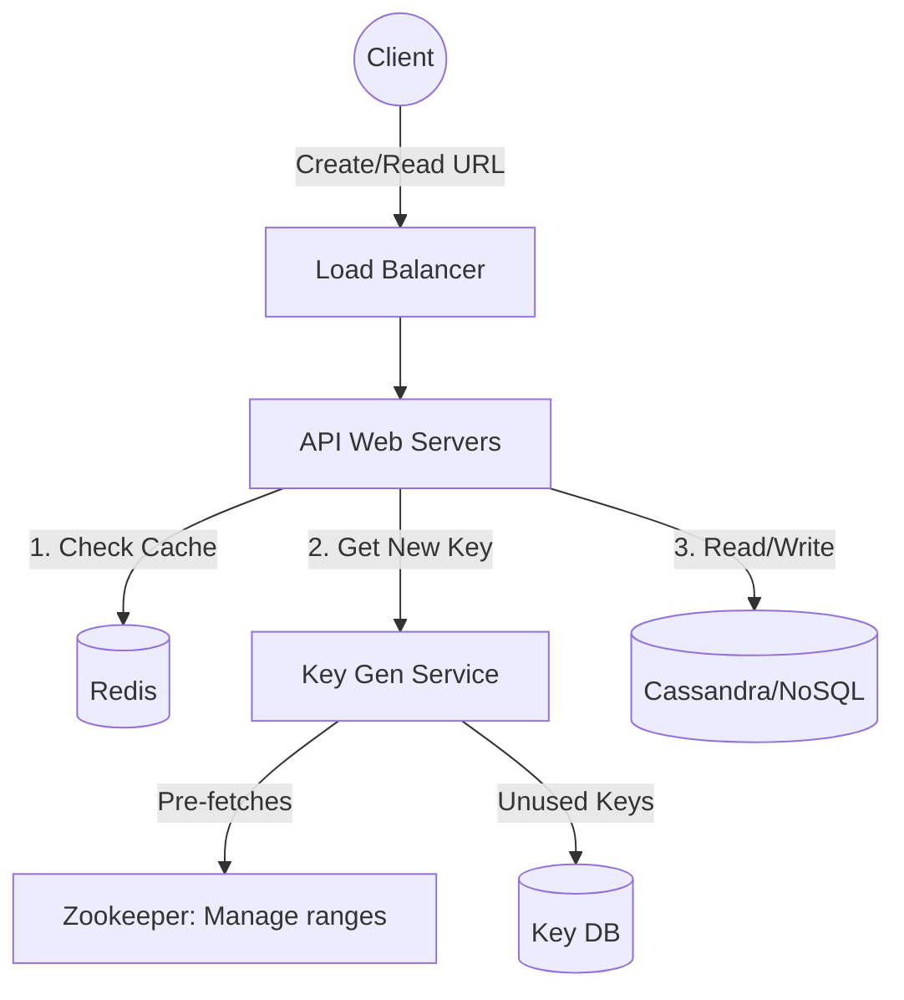

#### LLD Schema (NoSQL)
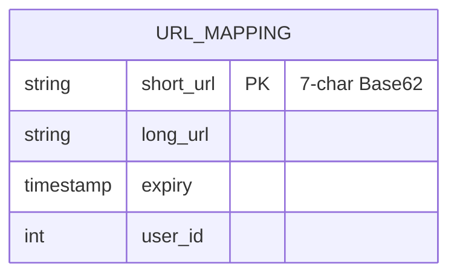

---

### Case Study 2: Social Media Newsfeed (Instagram / Twitter / Facebook)

**Assumptions & Requirements:**
*   **Traffic Focus:** Read-heavy. Needs extremely low latency (sub-200ms) for feed generation.
*   **Features:** Post photos/tweets, follow users, generate timeline.

**Ideality & Edge Cases:**
*   **The "Justin Bieber" (Celebrity) Problem:** Push architectures (Fan-out on write) crash when a user has 100M followers because one post triggers 100M database writes.
    *   *Solution:* **Hybrid Fan-out**. Normal users use push (fan-out on write). Celebrities use pull (fan-out on read). The client merges standard cached feeds with live-pulled celebrity posts on load.

#### HLD Flow
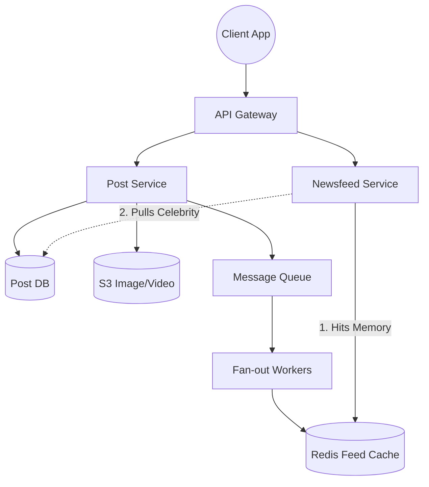

#### LLD Schema
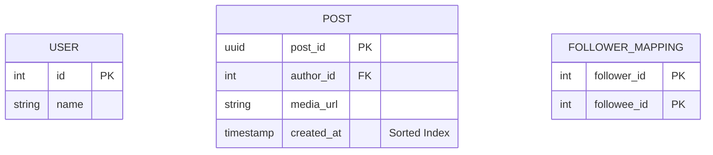

---

### Case Study 3: Ride-Hailing Service (Uber Backend / Yelp Proximity)

**Assumptions & Requirements:**
*   **Traffic Focus:** Extremely Write-Heavy (drivers broadcast location every 4 seconds).
*   **Features:** Match riders to nearest drivers.

**Ideality & Edge Cases:**
*   **Concurrency:** Two riders requesting a ride at the precise exact same microsecond might get matched to the same driver.
    *   *Solution:* **Redis Distributed Locks** or optimistic concurrency control via DB row versioning.
*   **Geospatial Lookups:** Querying SQL for `SELECT * WHERE lat < X and long < Y` requires full table scans.
    *   *Solution:* Use **QuadTrees** or **Geohashing (Google S2/Uber H3)**. This divides the map into a grid, assigning a string to each grid. Finding nearby drivers turns into a string prefix matching problem (O(1) in Redis).

#### HLD Flow
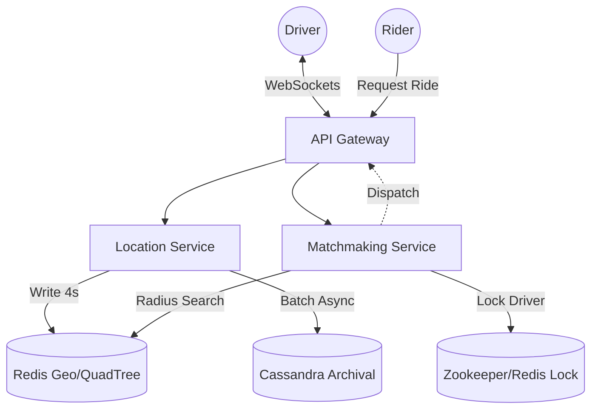

#### LLD Component (QuadTree Node)
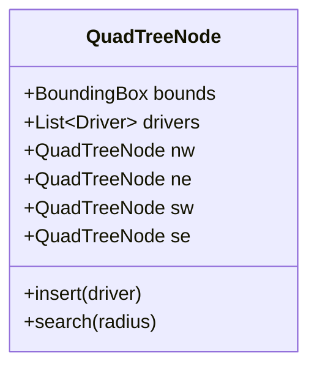

---

### Case Study 4: Video Streaming (YouTube / Netflix)

**Assumptions & Requirements:**
*   **Traffic Focus:** Immense bandwidth requirement. Read/Streaming heavy.
*   **Features:** Upload large video files, format conversion, seamless streaming.

**Ideality & Edge Cases:**
*   **Bandwidth Costs & Buffering:** Serving massive video files directly from data centers is too slow globally and too expensive.
    *   *Solution:* **Content Delivery Network (CDN)** integration. Break videos into small chunks (e.g., 5-second DASH/HLS segments). Push chunks to edge CDN servers globally.
*   **Encoding Bottleneck:** Video transcoding is incredibly CPU intensive.
    *   *Solution:* **DAG (Directed Acyclic Graph) Workflow System**. When a user uploads a video, queue tasks to worker nodes to split the video by audio, video, watermarking, and resolution (1080p, 720p, 480p) in parallel.

#### HLD Flow
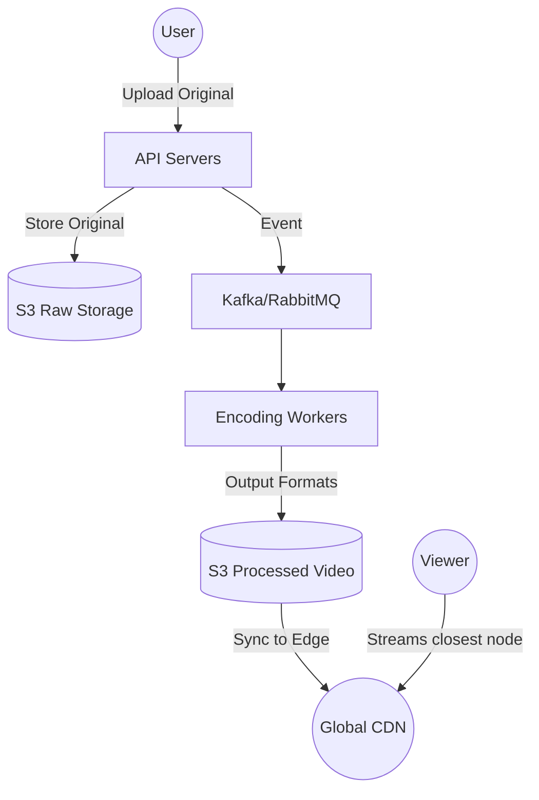

---

### Case Study 5: Highly Concurrent Booking (Ticketmaster / Hotel Reservation)

**Assumptions & Requirements:**
*   **Traffic Focus:** Read-heavy until tickets go on sale for a mega event, causing massive spiky transactional writes.
*   **Features:** Search events, reserve seat, purchase seat. Guarantee no double-booking.

**Ideality & Edge Cases:**
*   **The "Double Booking" Problem:** Millions of fans trying to book 50,000 seats at the exact same time.
    *   *Solution:* **ACID Relational Database** is mandatory here. Use SQL `SELECT ... FOR UPDATE` (Pessimistic Locking) or version numbers (Optimistic Locking).
*   **The "Held Seat" Problem:** User clicks reserve but doesn't check out.
    *   *Solution:* **Redis Cache TTL**. When reserved, write to Redis with a 10-minute expiry and update SQL. If the checkout succeeds, commit the purchase. If it expires, the seat returns to the available pool.

#### HLD Flow
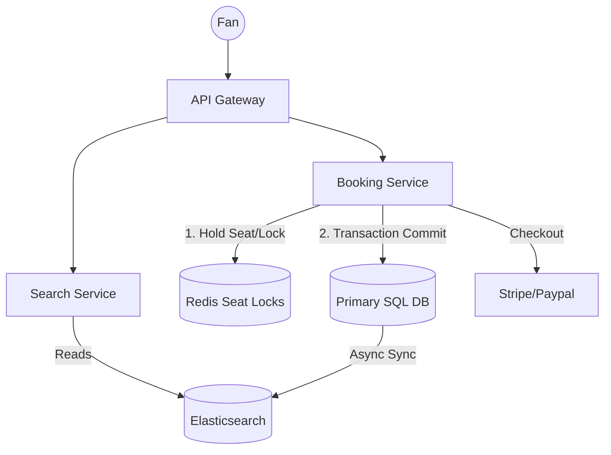

#### LLD Schema (SQL)
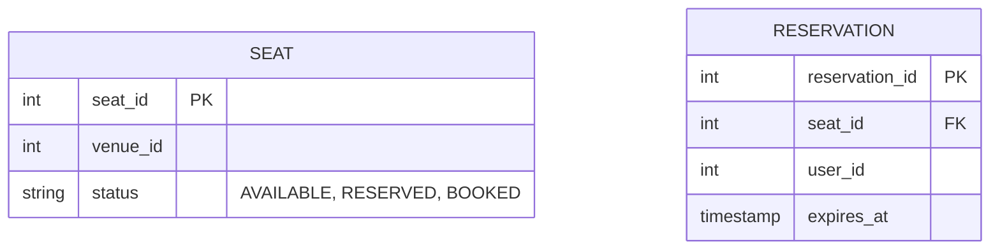

---

### Case Study 6: Scalable Web Crawler (Google Search)

**Assumptions & Requirements:**
*   **Goal:** Crawl billions of web pages and extract data.
*   **Ideality/Edge Cases:** Spider traps (infinite loops of URLs), polite crawling (don't DDoS a site), DNS lookup bottleneck.
    *   *Solution:* Maintain a `seen_urls` Bloom Filter (incredibly memory efficient for existence checks). Use a dedicated DNS Cache to prevent spamming DNS resolvers. Prioritize queues based on domain to ensure politeness delays between hits to the same domain.

#### HLD Flow
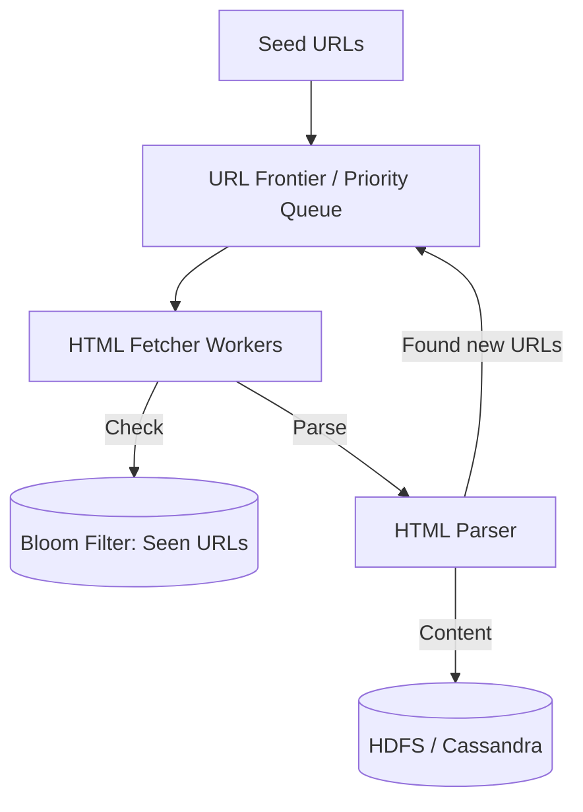

---

### Case Study 7: Real-Time Chat System (Facebook Messenger / WhatsApp)

**Assumptions & Requirements:**
*   **Traffic Focus:** Low latency, high throughput, bidirectional communication. Need strict message ordering.

**Ideality & Edge Cases:**
*   **Connection Management:** Keeping millions of open connections on simple HTTP servers will max out ports (65k limit) and RAM.
    *   *Solution:* Use **WebSockets** for persistent connections. Build a horizontally scalable fleet of stateless "Chat Servers".
*   **Routing Messages:** How does Server A know Server B holds the WebSocket for the recipient?
    *   *Solution:* A **Session/Presence Service** (backed by Redis or Zookeeper) maps `User_ID -> Chat_Server_IP`.

#### HLD Flow
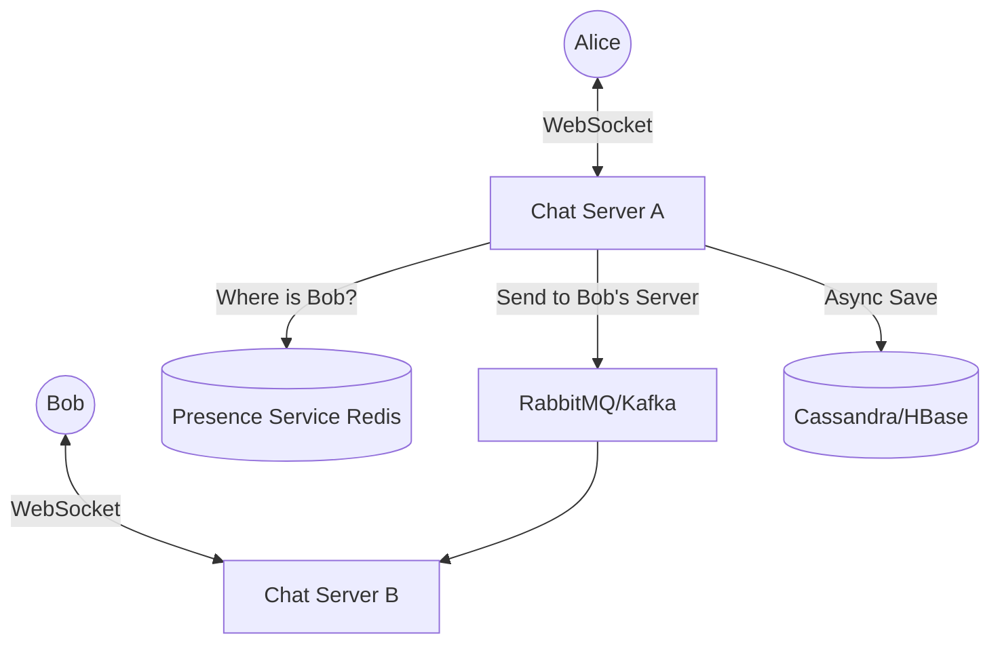

---

### Final Blueprint: Preparing for the Interview
When facing a system design question, always follow this blueprint:
1.  **Clarify the Scope:** "Are we building the web app or mobile? How many daily active users (DAU)?"
2.  **Back-of-the-envelope Estimations:** Calculate Queries Per Second (QPS) and storage needs for 5 years.
3.  **Define API Signatures:** `register(email, pass)`, `postTweet(user_id, content)`.
4.  **Database Design:** Layout the schema. Defend your choice of SQL vs. NoSQL.
5.  **High-Level Design:** Draw the core boxes (Client -> Load Balancer -> Service -> DB).
6.  **Deep Dive & Scaling:** Identify bottlenecks. Add Caching, Sharding, Message Queues, and fix SPOFs.
